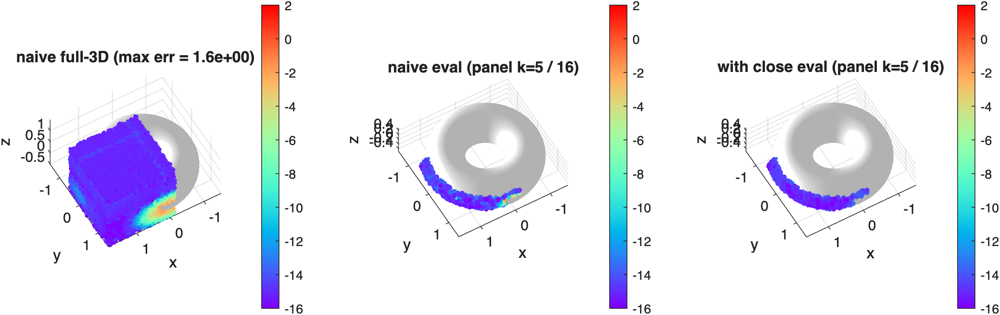

# axibie
Axisymmetric Boundary Integral Equation Tools in MATLAB

This repository provides tools in Matlab for solving the axisymmetric Laplace and Stokes problems. The numerical method in use is based on a high-order accurate panel-based boundary integral scheme. 

This project is in an early state. It contains functions from [BIE2D](https://github.com/ahbarnett/BIE2D).

The code supports modal/toroidal Laplace and Stokes Green's function in [`/src`](src) in fortran. All numerical results in [`/test/stokes`](test/stokes) and [`/test/laplace`](test/laplace) have been verified for Stokes and Laplace boundary value problems. [`/test/stokes`](test/stokes) and [`/test/laplace`](test/laplace) contain MATLAB codes calling [`/src`](src) fortran using MEX gateway functions automatically created via [mwrap](https://github.com/zgimbutas/mwrap).

The quadrature for modal/toroidal Laplace and Stokes Green's function is high-order kernel-split (see references), allowing near machine precision accuracies for targets near/on the boundary via one unified interface. For part of the kernel-split formula, see references. For the implementation, it is still in progress.

## Installation

Prerequisites: MATLAB (with its MEX compiler SDK), a recent `gfortran` (the [`Makefile`](Makefile) uses `gfortran-15`), and [mwrap](https://github.com/zgimbutas/mwrap) (expected at `~/mwrap/mwrap`).

Build the Fortran compute layer and the MEX gateway from the repository root:

```sh
git submodule update --init --recursive
make -f Makefile_kdtree
make mex                  # serial build
make mex OMP=ON           # OpenMP build
```

You can now run any driver in [`/test/stokes`](test/stokes) or [`/test/laplace`](test/laplace), e.g.

```matlab
run('test/laplace/test_axissymslap_lap_slp_bvp_0th.m')
run('test/laplace/test_axissymslap_lap_slp_bvp.m')
```

## Examples

### Single particle — mode by mode direct solve

A minimal close-evaluation: build a panel curve, then assemble the single-layer block matrix for a target sitting just outside the surface (where naive quadrature loses digits) — accurate to near machine precision.

```matlab
addpath utils matlab                               % from the repo root, after `make mex`

p = 16; np = 14;                                   % 14 panels x 16 Gauss nodes each
s = []; s.p = p; s.Z = @(t) sin(t) - 1i*cos(t);    % a curve: unit-sphere meridian (rho = sin t, z = -cos t)
s.tpan = linspace(0,pi,np+1)'; s = quadr(s,[],'p','G');

d = 1e-3;                                          % a target a distance d just OUTSIDE the surface
t = []; t.x = (1+d)*(sin(1.2) - 1i*cos(1.2));      %   (a unit-sphere point pushed out along its normal)

% 0th-mode axisymmetric Laplace single-layer block (iside=1 exterior, iclosed=0 open arc with axis poles)
A = axls_slp_blockmat_mex(numel(t.x), t.x, p, np, ...
      s.x, s.nx, s.ws, s.wxp, s.tpan, s.xlo, s.xhi, 1, 0, []);

u = A * ones(numel(s.x),1);                        % single-layer potential of a unit density at t
```

`A` is the `nt x N` close-evaluation operator (here `1 x 224`); swap `axls_slp_blockmat_mex` for `axls_{slpn,dlp,dlpn}_blockmat_mex` (Laplace) or `axss_*` (Stokes), and the `_nmode_mex` variants for all azimuthal modes at once. See [`/test/stokes`](test/stokes) and [`/test/laplace`](test/laplace) for full boundary-value-problem drivers.

### Single particle — one signature, two spaces (`modemat` / `physmat`)

The two level-2 setup masters share one argument list; a flag switches the solve space.
`iinter = 1` is the self operator (targets ignored); `iinter = 3` + 3D points evaluates.

```matlab
addpath utils matlab
p = 16; np = 14; pmodes = 8; iside = 1; iclosed = 0;
s = []; s.p = p; s.Z = @(t) sin(t) - 1i*cos(t);              % unit-sphere meridian
s.tpan = linspace(0,pi,np+1)'; s = quadr(s,[],'p','G');  N = numel(s.x);
sx = s.x(:); snx = s.nx(:); sws = s.ws(:); swxp = s.wxp(:); tpan = s.tpan(:);

space = 'modal';                       % 'modal' (Fourier, mode-by-mode) | 'phys' (dense physical)
ik = 1; il = 3; prm = 0;               % Laplace DLP; Stokes: ik=2, prm=mu (il: 1 SLP,2 SLPn,3 DLP,4 DLPn)
switch space
  case 'modal'                         % A(:,:,m) = azimuthal mode m-1 block, N x N x (pmodes+1)
    A = axp_modemat_setup_mex(ik, il, prm, 1, 1, p, np, pmodes, iside, iclosed, [1;N+1], [1;np+2], ...
          N, np+1, sx, snx, sws, swxp, tpan, 0, [1;1], zeros(3,0), zeros(3,0), eye(3), zeros(3,1), N, N);
  case 'phys'                          % assembled dense operator, node-interleaved, nblk x nblk
    nblk = N*(2*pmodes+1);             %   (x3 for Stokes: nc=3 dof per node)
    A = axp_physmat_setup_mex(ik, il, prm, 1, 1, p, np, pmodes, iside, iclosed, [1;N+1], [1;np+2], ...
          N, np+1, sx, snx, sws, swxp, tpan, 0, [1;1], zeros(3,0), zeros(3,0), eye(3), zeros(3,1), nblk, nblk);
end
```

Modal: solve each mode's small system, reconstruct with `e^(i*m*theta)` (single particle only —
modes decouple).  Physical: one dense solve, any azimuthal data.  Live drivers:
`test/laplace`/`test/stokes` `*_bvp.m` (modal) and `*_bvp_physmat*.m` (physical).

### A few particles — explicit full matrix + direct solve (whatever since problem size is not that large...)

Calling `axpso_close_setup` to build per-particle block in physical space. (particle by particle, then x-y-z-x-y-z..., ordering convention is different from `axpso_corr_setup`. It might be better to use particle by particle, then xxx-yyy-zzz from debugging perspective for me...)

```matlab
% two handles per layer: SELF (iinter=1) and CROSS (iinter=2); here Stokes SLP (2, 1, mu).
% Geometry packed as in the FMM rung below (flat per-particle arrays + prefix-sum offsets).
hself  = axpso_close_setup_mex(2, 1, mu, 1, K, pv, npv, pmv, iside, iclosed, gate, ...
           geomoff, tpanoff, nsx, ntpan, sxf, snxf, swsf, swxpf, tpanf, ...
           rball, K*Nnod, targoff, Xall, Nall, Rm, Cc, 0);          % FULL close-eval entries
hcross = axpso_close_setup_mex(2, 1, mu, 2, K, pv, npv, pmv, iside, iclosed, gate, ...
           geomoff, tpanoff, nsx, ntpan, sxf, snxf, swsf, swxpf, tpanf, ...
           rball, K*Nnod, targoff, Xall, Nall, Rm, Cc, 0);
axpso_close2corr_set_mex(hself,  K, geomoff, nsx, sxf, snxf, swsf, targoff, K*Nnod, Xall, Nall, Cc);
axpso_close2corr_set_mex(hcross, K, geomoff, nsx, sxf, snxf, swsf, targoff, K*Nnod, Xall, Nall, Cc);

n = 3*K*Nnod;                                                       % Stokes: 3 dof per node
A = real(Sto3dSLPmat_il(struct('x',Xall), struct('x',Xall,'w',wall)));  % dense naive Stokeslet matrix
A = zeroselfblk(A, K*Nnod);                                         % singular self-interaction -> 0
A = axpso_corr2dense_get_mex(hself,  n, n, A);                      % + self corrections (ACCUMULATES)
A = axpso_corr2dense_get_mex(hcross, n, n, A);                      % + cross corrections
sigma = lsqminnorm(A, g);                                           % direct solve (min-norm: Stokes S
                                                                    %  has the pressure null space)
```

Per-particle compact blocks are also individually readable/writable (`axpso_corr_get_mex` /
`axpso_corr_set_mex`) — e.g. summing the D and S corrections of a combined-field operator into one
handle.  Working driver: [`test/stokes_multi/test_axissymsstok_stok_slp_bvp_multi_physmat.m`](test/stokes_multi/test_axissymsstok_stok_slp_bvp_multi_physmat.m);
the full 4×2 layer/kernel validation matrix lives in
[`test/laplace_multi`](test/laplace_multi) and [`test/stokes_multi`](test/stokes_multi) (READMEs with
convergence figures).

### Many particles — sparse near-correction + FMM (matrix-free solve)

At scale the close-evaluation becomes a *sparse* correction added to a global FMM, addressed by a **handle**. `axpso_corr_setup_mex` builds and stores the whole near-correction (kdtree detection + per-particle blocks) as a self-describing object in ONE call — the correction directly, no dense operator ever formed; `axpso_corr_apply_mex` accumulates it into a matvec.

```matlab
% K panel-meridian particles on a lattice; geometry packed into flat per-particle arrays
% + prefix-sum offsets (pv/npv/pmv, geomoff/tpanoff/targoff, sxf..tpanf, Rm/Cc) -- see the
% drivers below.  Here: Laplace SLPn (ikernel=1, ilayer=2, params=0), exterior (iside=1).
n = K*Nnod;                                        % scalar Laplace: 1 dof per node

% the near correction as two handles -- SELF (iinter=1) and CROSS (iinter=2):
hself  = axpso_corr_setup_mex(1, 2, 0.0, 1, K, pv, npv, pmv, iside, iclosed, gate, ...
           geomoff, tpanoff, nsx, ntpan, sxf, snxf, swsf, swxpf, tpanf, ...
           rball, n, targoff, Xall, Nall, Rm, Cc, 0);
hcross = axpso_corr_setup_mex(1, 2, 0.0, 2, K, pv, npv, pmv, iside, iclosed, gate, ...
           geomoff, tpanoff, nsx, ntpan, sxf, snxf, swsf, swxpf, tpanf, ...
           rball, n, targoff, Xall, Nall, Rm, Cc, 0);

% one matvec of (-1/2 I + S'):  naive FMM (self i~=j excluded) + the two near corrections,
% each ACCUMULATING into y (the -1/2 jump rides inside the self block):
srcinfo.sources = Xall; srcinfo.charges = (sigma(:).').*wall;
U = lfmm3d(1e-12, srcinfo, 2);                     % potential + gradient at the sources
y = (sum(U.grad.*Nall,1)).';                       % naive S' = grad(pot) . n
y = axpso_corr_apply_mex(hself,  n, sigma, n, y);  % self  correction
y = axpso_corr_apply_mex(hcross, n, sigma, n, y);  % cross correction
% wrap these lines in a function handle -> gmres for the exterior-Neumann solve
```

The *same* two calls serve every kernel and layer — `(2, 2, mu)` is the Stokes traction, `(2, 3, mu)`
the Stokes double layer, etc.; the lab↔local rotation rides inside the module (from the stored `Rm`),
so the matvec stays frame-agnostic. Calling `axpso_corr_apply_mex(h, nx, sigma, nu, u)` with `nu ≠ nx`
evaluates the solution at *arbitrary* off-surface targets (field eval). Combined-field operators sum
their layer corrections into one handle (`corr_get` + `corr_set`), halving the apply cost. Full FMM +
GMRES drivers, scaling from `K=8` to the `K=3375` ultra:
[`test/laplace_max`](test/laplace_max) (Laplace SLPn) and [`test/stokes_max`](test/stokes_max)
(Stokes SLPn traction + the combined-field `(D+S)` Dirichlet variant).

## Verification

- `test/laplace/test_axissymslap_lap_greens_identity.m` — Laplace Green's identity on a torus
  (exterior GRF, all modes): naive eval is `O(1)` wrong at targets near the surface; swapping in
  the per-panel physical-space close eval for the k-th panel
  restores machine precision at its close targets.

  

## References

1. The Pozrikidis

2. Hanliang Guo, Hai Zhu, Ruowen Liu, Marc Bonnet, and Shravan Veerapaneni. 2021. “Optimal Slip Velocities of Micro-Swimmers with Arbitrary Axisymmetric Shapes.” *Journal of Fluid Mechanics* 910.

3. Sijia Hao, Alex H Barnett, Per-Gunnar Martinsson, and P Young. 2014. “High-Order Accurate Methods for Nyström Discretization of Integral Equations on Smooth Curves in the Plane.” *Advances in Computational Mathematics* 40 (1): 245–72.

4. Johan Helsing, and Anders Karlsson. 2014. “An Explicit Kernel-Split Panel-Based Nyström Scheme for Integral Equations on Axially Symmetric Surfaces.” *Journal of Computational Physics* 272: 686–703.

5. Shravan Veerapaneni, Denis Gueyffier, George Biros, and Denis Zorin. 2009. “A Numerical Method for Simulating the Dynamics of 3d Axisymmetric Vesicles Suspended in Viscous Flows.” *Journal of Computational Physics* 228 (19): 7233–49.

6. Bowei Wu, Hai Zhu, Alex Barnett, and Shravan Veerapaneni. 2020. “Solution of Stokes Flow in Complex Nonsmooth 2d Geometries via a Linear-Scaling High-Order Adaptive Integral Equation Scheme.” *Journal of Computational Physics* 410: 109361.

7. James Garritano, Yuval Kluger, Vladimir Rokhlin, Kirill Serkh. 2022. "On the efficient evaluation of the azimuthal Fourier components of the Green's function for Helmholtz's equation in cylindrical coordinates." *Journal of Computational Physics* 471: 111585.


## To do list

* (debug DLPn done, need more testing) Implement high order Fourier modes to enable nonsymmetric potential and flow simulation
* (prototype done, need cleanup and memory footprint reduction) Implement multiple partciles + possible interaction with confined geometry
* (what is SLPnn, DLPnn? Azz in Dspecialquad for 2D?) Laplace case is a by-product, why not
* (prototype done) Accelerate via FMM3D/PVFMM/DMK
* (need to learn) 3d flow visualization
* (do we need variation in centerline/not axisymmetric any more) CSBQ
