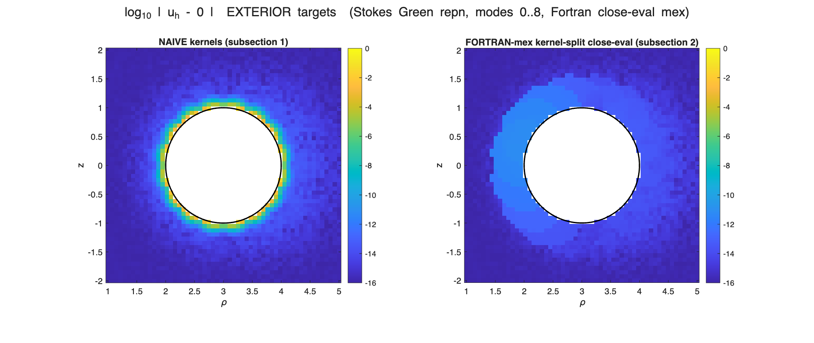

# Axisymmetric Stokes close-evaluation — MATLAB tests

Per-panel azimuthal-mode close-evaluation for the axisymmetric Stokes SLP/DLP, run on the compiled
Fortran mex (`axm_specialquad_slp/dlp_mex` near, `axa_kernel_slp/dlp_mex` far). The split
coefficients (`axissymstok_kernelsplit_mod.f90`) are hidden for now.

## `test_axissymstok_GRF.m` — Green's representation

`u = S[σ] + D[τ]` with `σ = traction(u)`, `τ = -u`: reproduces an off-axis Stokeslet inside, and 0
outside. Exterior targets only (no mode-truncation floor), so it isolates the close-eval accuracy.

```
  SUBSECTION 1 (naive):       exterior near (<0.05) max err = 8.4e-02   (naive quadrature fails)
  SUBSECTION 2 (Fortran mex): exterior near (<0.1)  max err = 7.6e-12   (close-eval floor, modes 0..8)
```



Left: naive kernels (bright error ring at the surface). Right: close-eval (uniform `~1e-11` floor).

## `test_axissymstok_dirichlet.m` — combined-field interior Dirichlet solve

Combined-field representation, single density `μ`, total field `u = (V^S + V^D)[μ]`:

```
(-I/2 + V^S_m + V^D_m) μ_m = f_m       per azimuthal mode
```

The `-I/2` comes from the DLP interior limit (`iside=0`), so `A_m = S_block + D_block` — no separate
jump term. Manufactured data: off-axis exterior Stokeslets. Solved per mode, then evaluated on a
full 3D interior meshgrid.

```
  interior 3D grid: 2760 targets, max ||u-u_exact|| = 9.5e-12
```


Left: boundary data `u` on the surface (color `|u|`, arrows, red ▲ = sources). Right:
`log10 ||u_h − u_exact||` at interior targets (colorbar `[-16,-8]`).

## Running

```matlab
test_axissymstok_GRF
test_axissymstok_dirichlet
```
