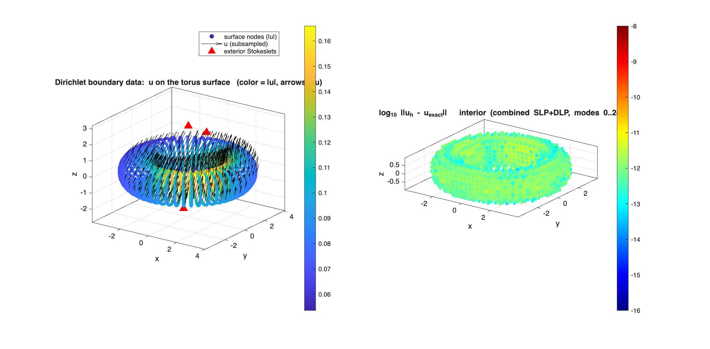
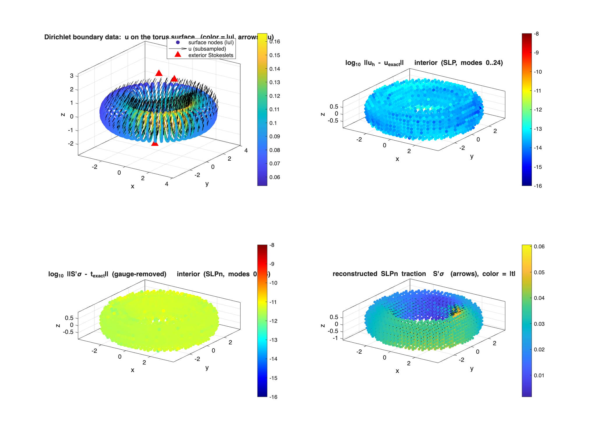

# Axisymmetric Stokes close-evaluation — chunkie tests(to be fixed after all stokes and laplace kernel, and checkout commit e8534b339cec88e3b65b57605ec26acb4363ad86 to begin with)

Per-panel azimuthal-mode close-evaluation for the axisymmetric Stokes SLP/DLP, run on the compiled
Fortran mex (`axm_specialquad_slp/dlp_mex` near, `axa_kernel_slp/dlp_mex` far). The split
coefficients (`axissymstok_kernelsplit_mod.f90`) are hidden for now.

## `test_axissymstok_GRF.m` — Green's representation

`u = S[σ] + D[τ]` with `σ = traction(u)`, `τ = -u`: reproduces an off-axis Stokeslet inside, and 0
outside. Exterior targets only (no mode-truncation floor), so it isolates the close-eval accuracy.

```
  SUBSECTION 1 (naive):       exterior near (<0.05) max err = 8.4e-02   (naive quadrature fails)
  SUBSECTION 2 (Fortran mex): exterior near (<0.1)  max err = 7.6e-12   (close-eval floor, modes 0..8)
```


Left: naive kernels (bright error ring at the surface). Right: close-eval (uniform `~1e-11` floor).

## `test_axissymstok_dirichlet.m` — combined-field interior Dirichlet solve

Combined-field representation, single density `μ`, total field `u = (V^S + V^D)[μ]`:

```
(-I/2 + V^S_m + V^D_m) μ_m = f_m       per azimuthal mode
```

The `-I/2` comes from the DLP interior limit (`iside=0`), so `A_m = S_block + D_block` — no separate
jump term. Manufactured data: off-axis exterior Stokeslets. Solved per mode, then evaluated on a
full 3D interior meshgrid.

```
  interior 3D grid: 2760 targets, max ||u-u_exact|| = 9.5e-12
```



Left: boundary data `u` on the surface (color `|u|`, arrows, red ▲ = sources). Right:
`log10 ||u_h − u_exact||` at interior targets (colorbar `[-16,-8]`).

## `test_axissymstok_dirichlet_slpn.m` — SLP interior Dirichlet solve + SLPn traction

Single-layer representation `u = V^S[σ]`, solved per mode `V^S_m σ_m = f_m` (same manufactured
exterior-Stokeslet data). Since `V^S[σ] = u^ex` inside, the single-layer traction recovers the exact
Stokeslet traction, evaluated on the same interior meshgrid with the SLPn mex
(`axm_specialquad_slpn_mex` near, `axa_kernel_slpn_mex` far). Target normal: one fixed cartesian
`n_0 = [1,-2,2]/3` (so `n_θ ≠ 0`, exercising the swirl block).

```
  interior 3D grid: 2760 targets, max ||u-u_exact|| = 4.7e-13
  interior SLPn traction: raw max 2.3e-02 | gauge-removed max 1.5e-11
```

The raw `~2e-2` is the single-layer pressure gauge (one constant vector, since `n_0` is fixed);
removing it (subtract one target) recovers the close-eval floor.



Top: boundary data, SLP velocity error. Bottom: gauge-removed `log10 ||S'σ − t_exact||` and the
reconstructed traction `S'σ` (arrows, color `|t|`).

## Running

```matlab
test_axissymstok_GRF
test_axissymstok_dirichlet
test_axissymstok_dirichlet_slpn
```
