# Laplace axisymmetric BIE close-evaluation

> Laplace pipeline: all four layer kernels
> (SLP, SLPn, DLP, DLPn) driven through the delta Fortran block-matrix mexes
> (`axls_*_blockmat[_nmode]_mex`), each posed as an exterior BVP — solved per azimuthal
> mode and resummed — against an exact harmonic field.

## Results

Laplace SLP first-kind exterior-Dirichlet BVP (solve `S[sigma] = u`, eval potential `S[sigma]`),
all-modes, h-refinement (`test_axissymslap_lap_slp_bvp.m`, `np=2:16`, `pmodes=2*np`): spectral
convergence to the `~1e-14` close-eval floor at `np~=11`. Interior point charges give the exact
exterior harmonic potential.

| h-refinement convergence | 3D target-grid error (`np=16`) |
|---|---|
| 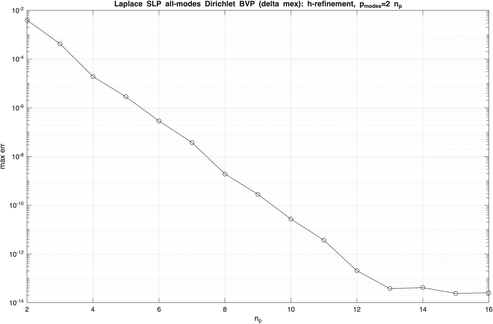 | 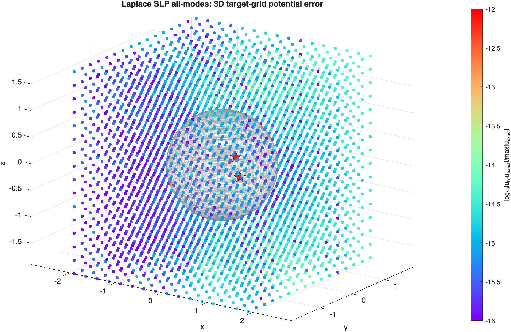 |

Combined `(D+S)` exterior-Dirichlet BVP (solve `(1/2 I + D + S)sigma = u`, eval `(D+S)sigma`),
all-modes, h-refinement (`test_axissymslap_lap_dlp_bvp.m`, `np=2:16`, `pmodes=2*np`): spectral
convergence to `~1e-14` at `np~=11`. Pure `D` cannot represent the `1/r` monopole of a nonzero net
charge (the double layer decays `1/r^2`); the `S` term supplies it and makes the second-kind operator
well-conditioned (`cond ~ O(1)`). The `D`-block side `'e'` carries the `+1/2` exterior-trace jump.

| h-refinement convergence | 3D target-grid error (`np=16`) |
|---|---|
| 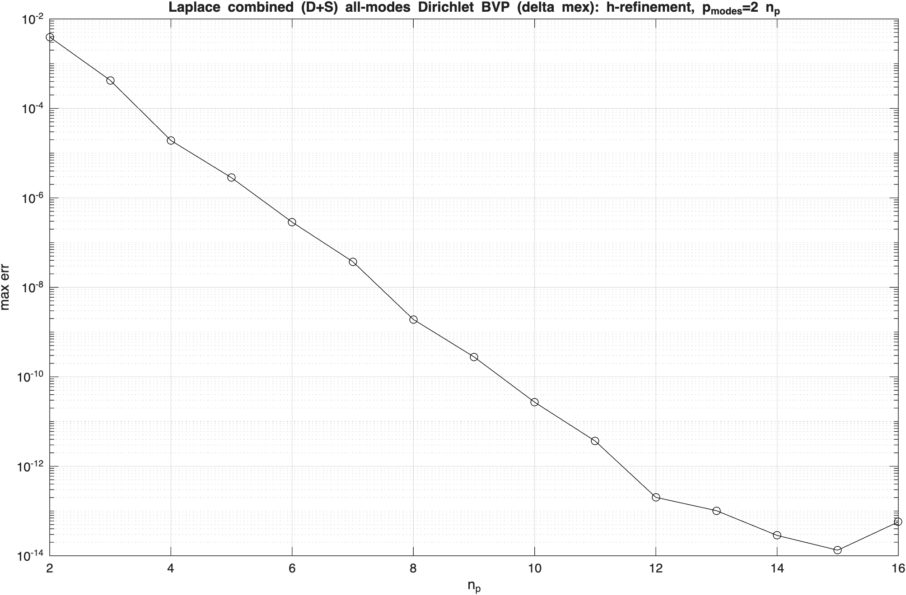 | 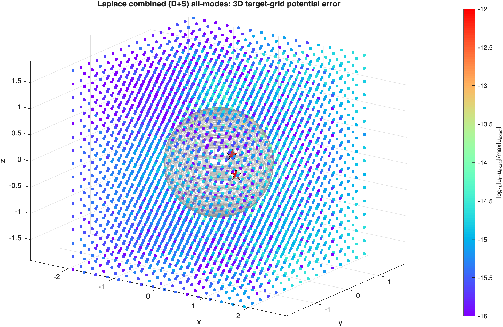 |

Laplace SLPn first-kind exterior-Neumann BVP (solve `(-1/2 I + S')sigma = dn u`, eval `S[sigma]`),
all-modes, h-refinement (`test_axissymslap_lap_slpn_bvp.m`, `np=2:16`, `pmodes=2*np`): spectral
convergence to the `~1e-13` close-eval floor at `np~=11`. `S' = d_n S` is the target-normal
single-layer traction (the adjoint DLP); `cond ~ O(1)`, exterior Neumann unique (no constant gauge).

| h-refinement convergence | 3D target-grid error (`np=16`) |
|---|---|
| 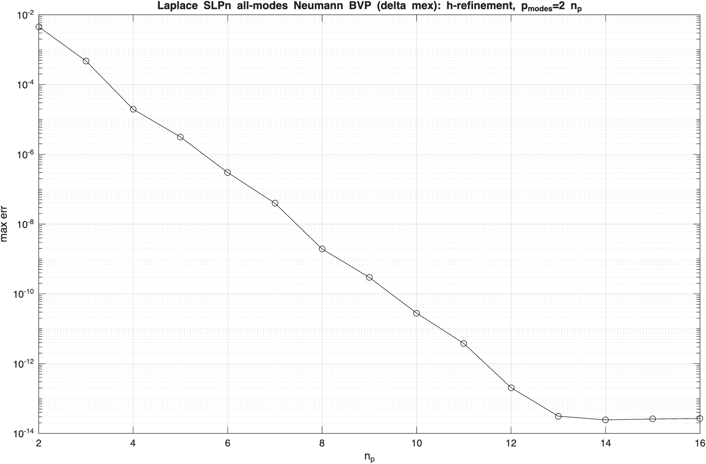 | 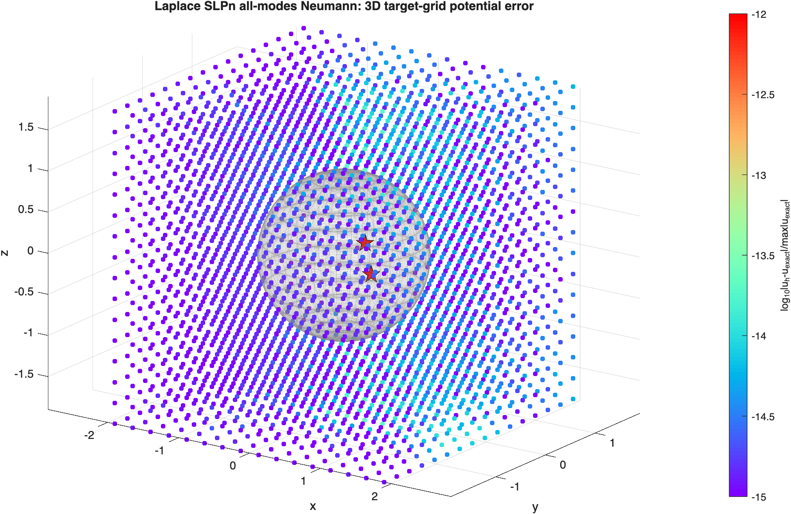 |

Combined `(S'+D')` exterior-Neumann BVP (solve `(-1/2 I + S' + D')sigma = dn u`, eval `(S+D)sigma`),
all-modes, h-refinement (`test_axissymslap_lap_dlpn_bvp.m`, `np=2:16`, `pmodes=2*np`): spectral
convergence to the `~1e-12` close-eval floor at `np~=11`. `D' = d_n d_n' G` is the super-singular
`1/(r-r')^3` double-layer traction (five-channel split, `2p` upsample-and-project close-eval,
`(Q,Q',Q'')`-Hessian-carrier analytic far, `m=0` row-sum `D'_0[1]=0`); adding it regularizes the
single-layer Neumann resonances and keeps the field well-conditioned (`cond ~ 1e2`).

| h-refinement convergence | 3D target-grid error (`np=16`) |
|---|---|
| 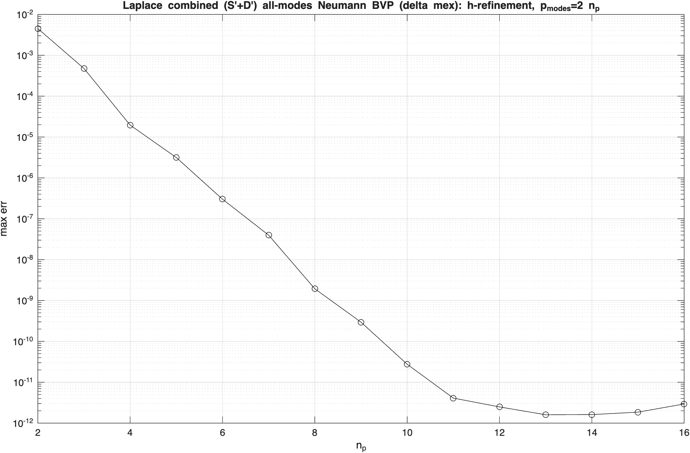 | 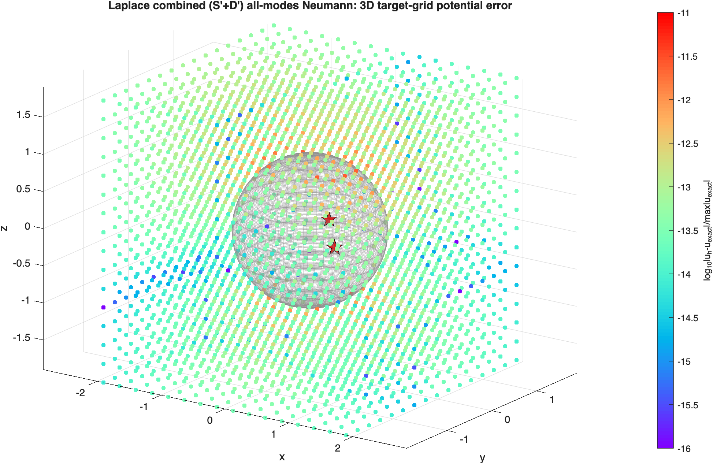 |

0th-mode-only Laplace SLP exterior-Dirichlet BVP on a c-shape (solve `S sigma = u`, eval `S sigma`),
exact axisymmetric ring-charge potential (`test_axissymslap_lap_slp_bvp_0th.m`, `np=6:2:36`):
spectral convergence to the `~1e-15` close-eval floor.

| h-refinement convergence | meridian-grid error (`np=36`) |
|---|---|
| 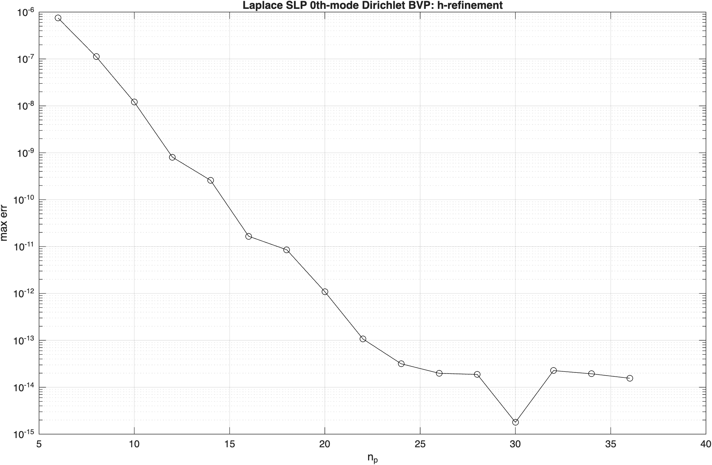 | 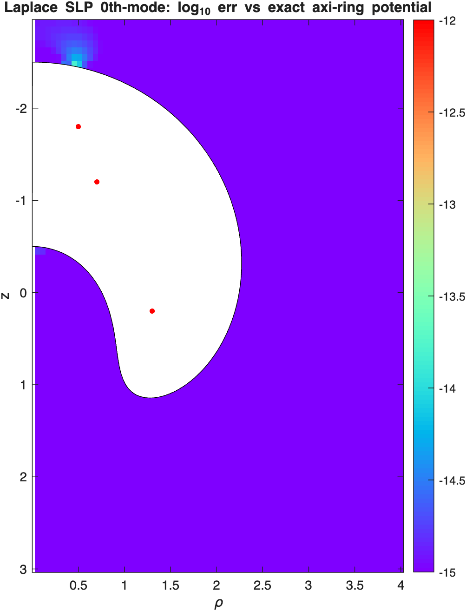 |

0th-mode-only combined `(D+S)` Laplace exterior-Dirichlet BVP on a c-shape (solve
`(1/2 I + D + S)sigma = u`, eval `(D+S)sigma`), exact ring-charge potential
(`test_axissymslap_lap_dlp_bvp_0th.m`, `np=6:2:36`): spectral convergence to the `~1e-12` DLP-Cauchy
close-eval floor.

| h-refinement convergence | meridian-grid error (`np=36`) |
|---|---|
| 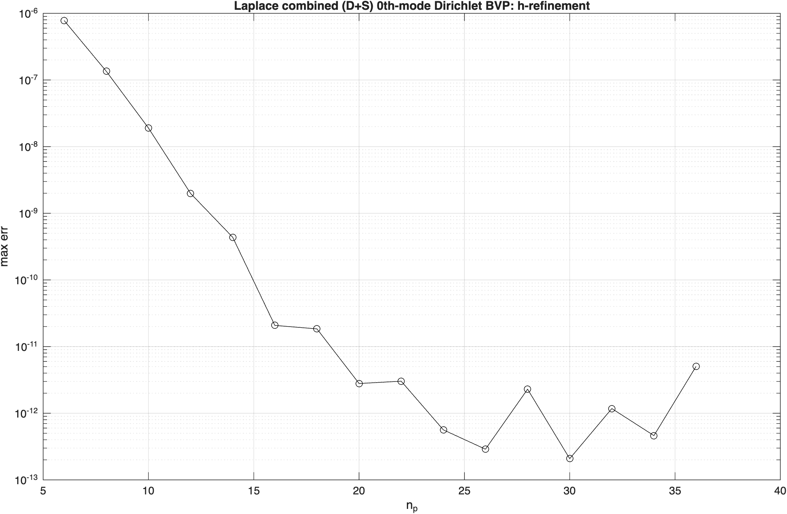 | 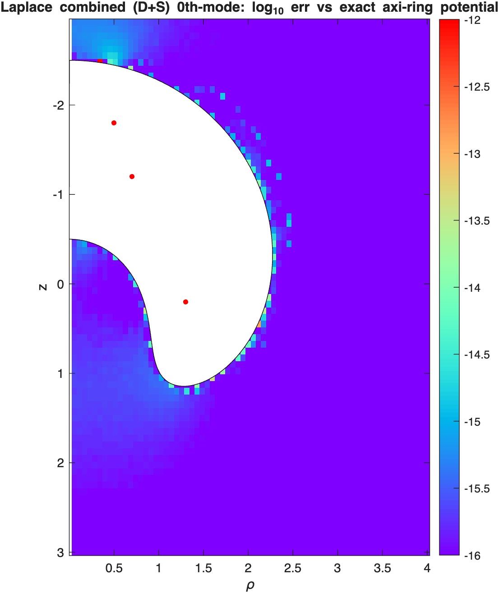 |

0th-mode-only Laplace SLPn exterior-Neumann BVP on a c-shape (solve `(-1/2 I + S')sigma = dn u`,
eval single-layer potential `S[sigma]`), exact ring-charge potential with Neumann data `dn u` built by
azimuthal quadrature of the 3D point-charge gradient (`test_axissymslap_lap_slpn_bvp_0th.m`,
`np=6:2:36`): spectral convergence to the `~1e-15` close-eval floor.

| h-refinement convergence | meridian-grid error (`np=36`) |
|---|---|
| 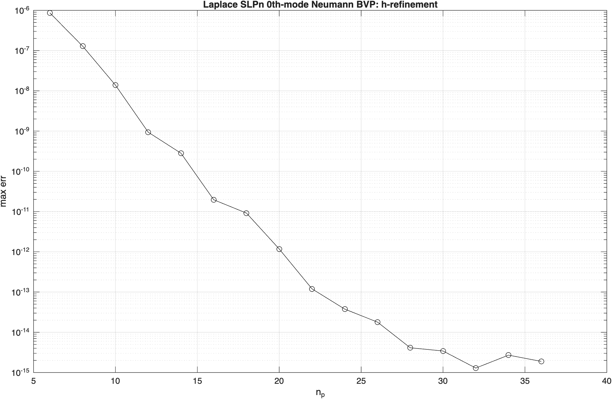 | 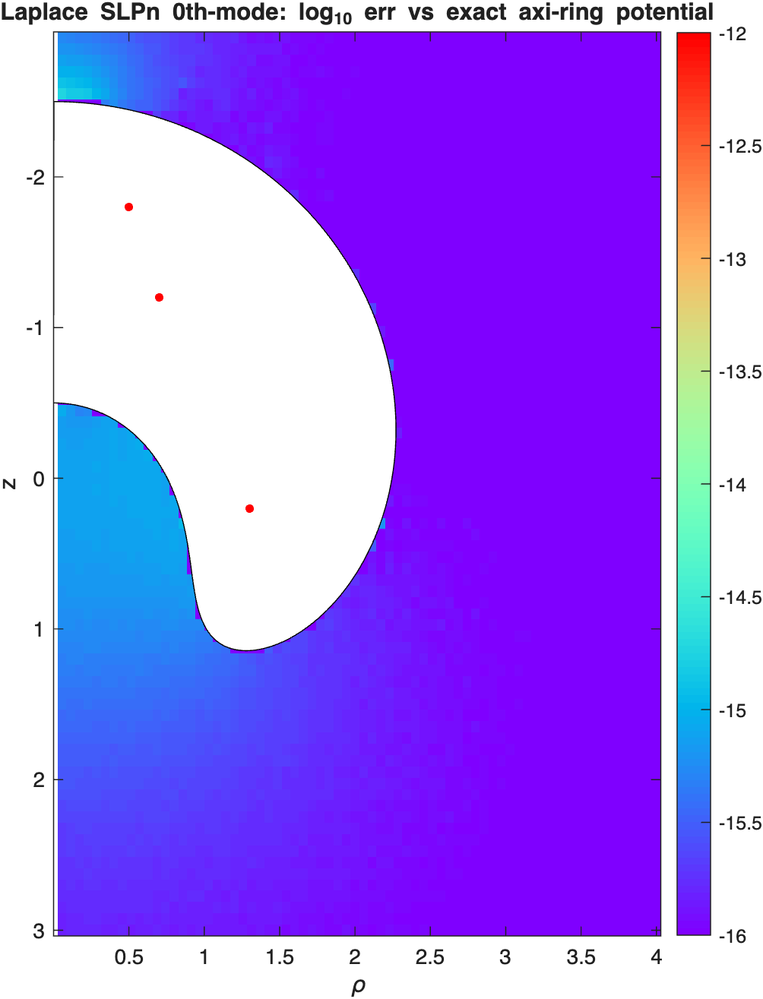 |

0th-mode-only combined `(S'+D')` Laplace exterior-Neumann BVP on a c-shape (solve
`(-1/2 I + S' + D')sigma = dn u`, eval `(S+D)sigma`), exact ring-charge potential
(`test_axissymslap_lap_dlpn_bvp_0th.m`, `np=6:2:36`): spectral convergence to the `~1e-12`
hypersingular close-eval floor.

| h-refinement convergence | meridian-grid error (`np=36`) |
|---|---|
| 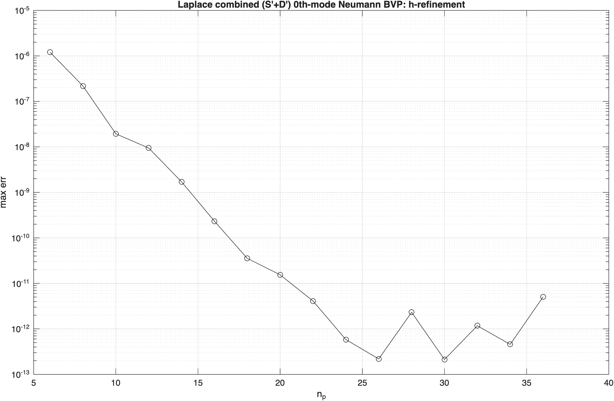 | 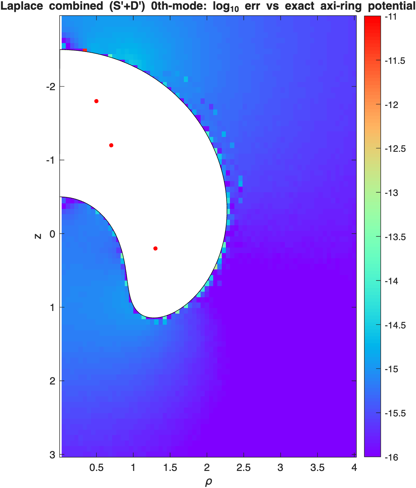 |

## Physical-space (physmat) pipeline: naive + sparse close correction

Laplace SLP exterior-Dirichlet BVP in PHYSICAL space -- all azimuthal modes solved at once on
the 3D surface grid (`test_axissymslap_lap_slp_bvp_physmat.m`, `np=2:16`, `pmodes=2*np`,
`nang=2*pmodes+1`).  The self operator is never built accurately entrywise: it is the naive
`Lap3dSLPmat` (FMM-replaceable, self-diagonal zeroed) plus a kdtree-detected COMPACT close
correction -- per source panel, the accurate per-panel-fourier close-eval minus naive on the
azimuth-0 target orbit representatives (`S_ij(ntcx, nang*p)`), expanded to all target azimuths
by the circulant symmetry at assembly.  Pipeline fully compiled: `axps_closesize_mex` (kdtree
sizing) -> `axps_closeslp_mex` (per-panel fourier compute) -> `axps_closeasm_mex` (naive +
circulant scatter); solve `lsqminnorm` (SLP meridian null space); 3D field eval matrix-free =
`Lap3dSLPfmm` far + `axps_closecorrapply_mex` (kernel-free sparse correction apply).
Correction storage `ntcx*nang*p` vs the dense operator's `(N*nang)^2`.

| h-refinement convergence | 3D target-grid error (`np=16`) |
|---|---|
| 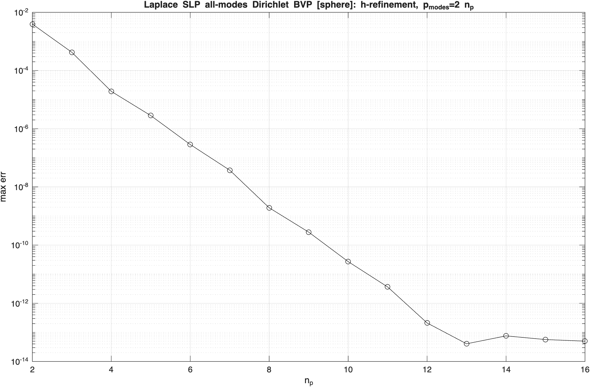 | 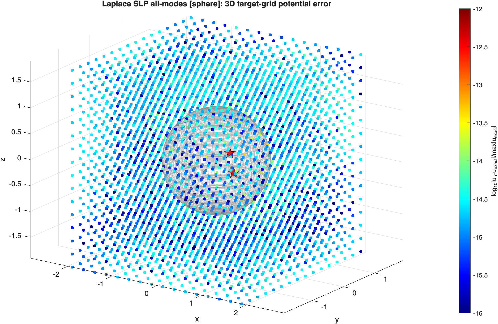 |

Combined `(D+S)` exterior-Dirichlet BVP in PHYSICAL space
(`test_axissymslap_lap_dlp_bvp_physmat.m`, `np=2:16`, `pmodes=2*np`): same three-pass close
build run twice per geometry -- `axps_closeslp_mex` and `axps_closedlp_mex` share one detection
(`tcxi/idxall`) and one signature (3D ring normals `s3dnx` explicit; the DLP recipe follows
`axissymlap_dlp_blockmat_nmode_r64`: `Kvk*vk + Kve*ve` source-normal carrier + source-Cauchy
`2pi*C3*Re(Ad)` inner-near).  Assembly selects the naive kernel via `(iphys, ilayer, nc)`
mirroring `axp_offdiagphysmat`; no explicit `1/2 I` -- the `iside` branch of the close-eval
takes the one-sided exterior limit, so `A = As + Ad` is solved directly by unrestarted GMRES
(second-kind: mesh-independent iteration count printed per refinement).  Field eval = the
`S` and `D` FMM+corrapply chains summed.

| h-refinement convergence | 3D target-grid error (`np=16`) |
|---|---|
| 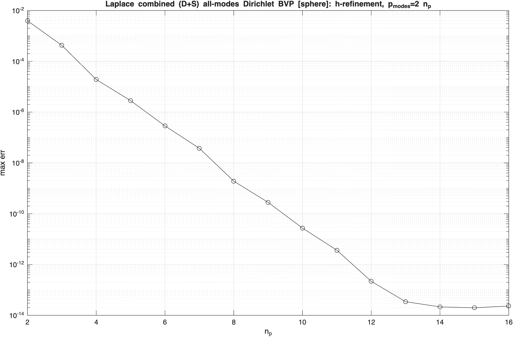 | 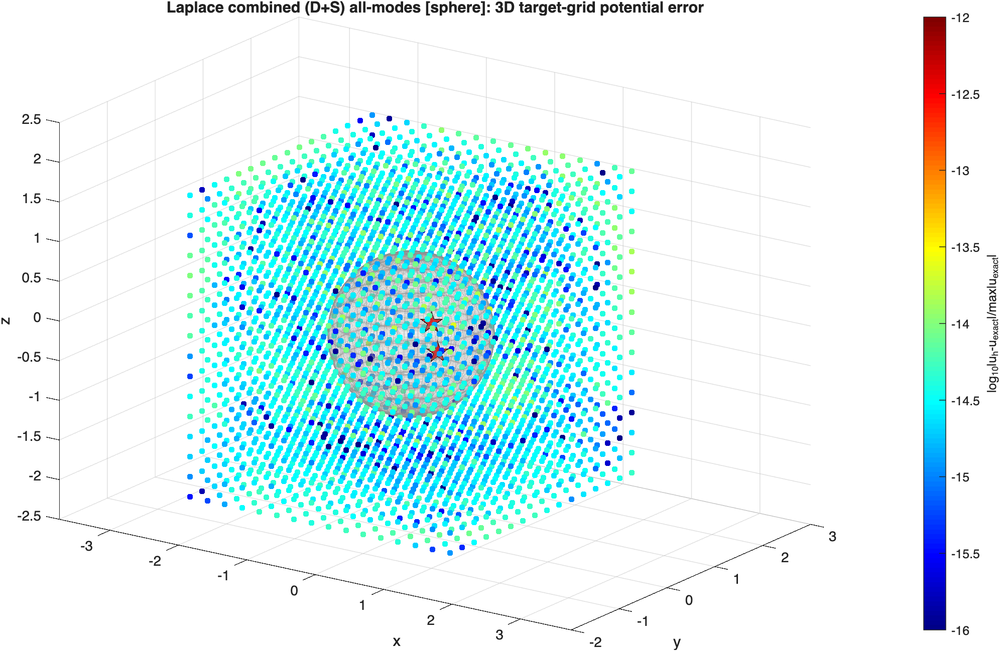 |
