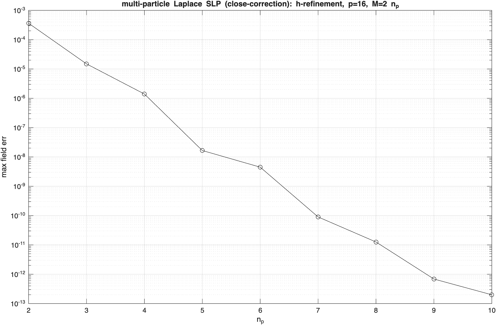
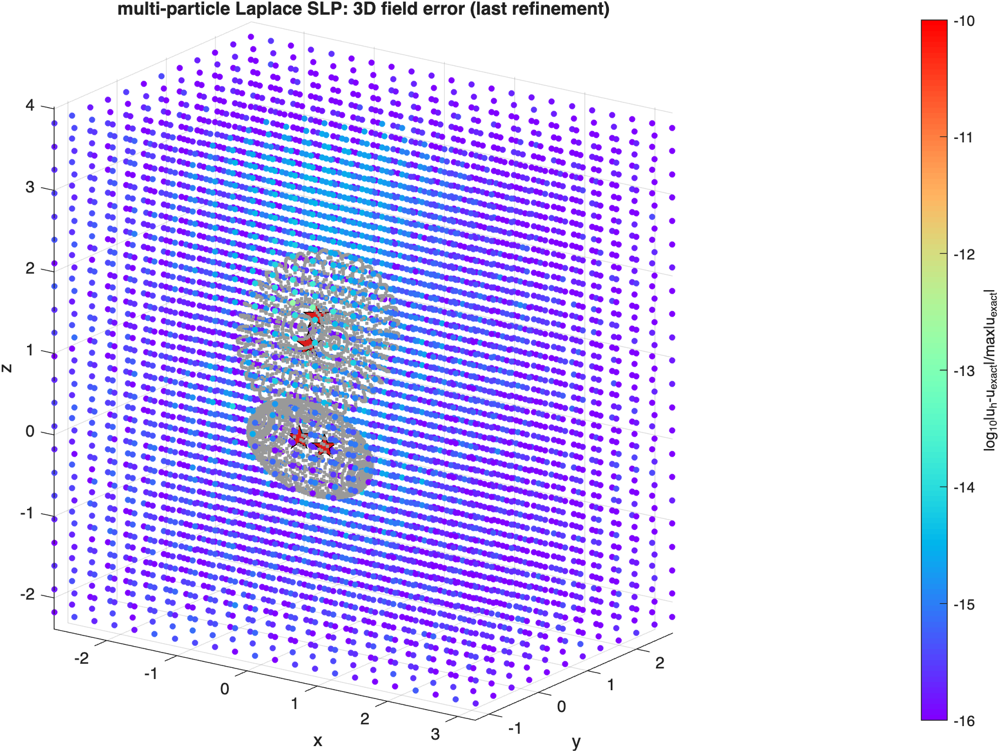
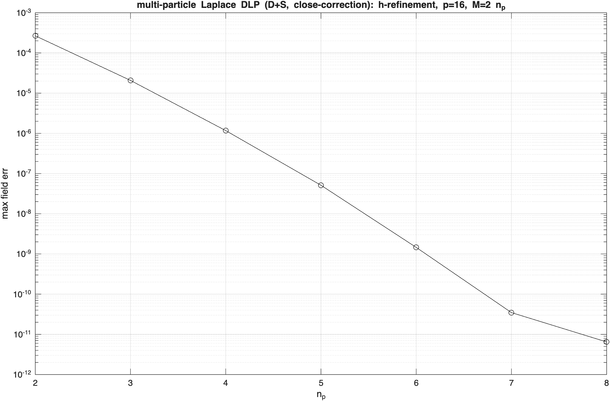
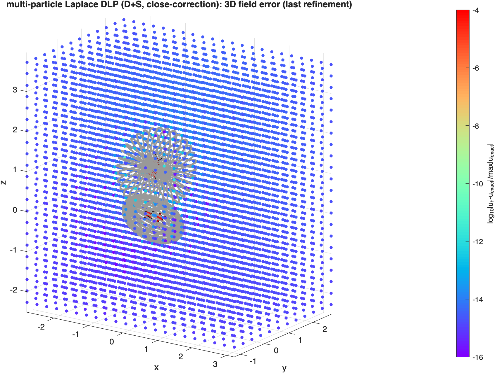
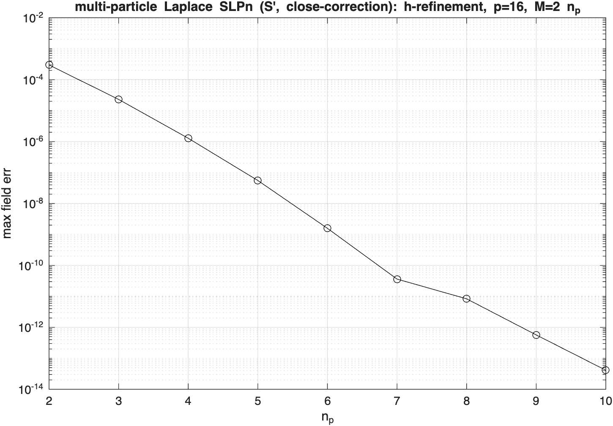
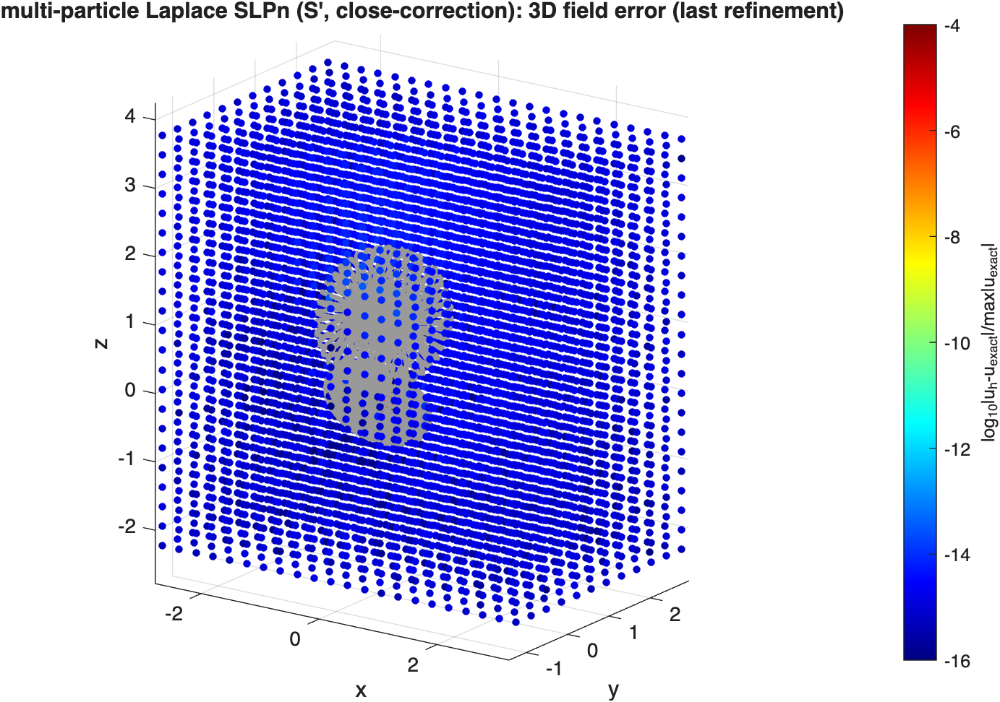
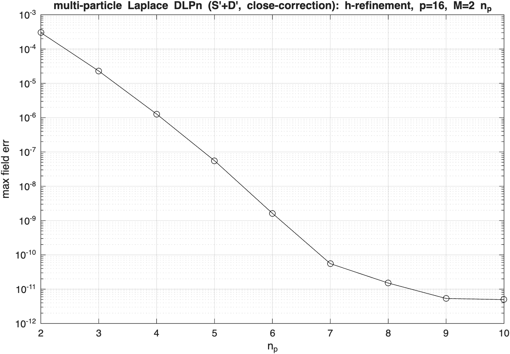
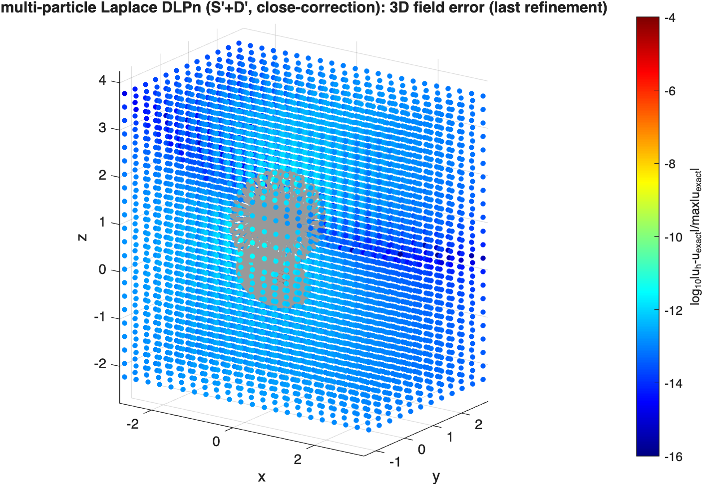

# axp — multi-particle Laplace physical-space operators (close correction)

## Results

Two prolate/oblate spheroids in random pose; interior point charges inside each body give the exact
exterior harmonic field. Every layer uses the same close-correction architecture — a naive full operator
`S` (FMM-replaceable) plus a sparse `Scorr` (per-particle self diffs + kdtree near off-diagonal diffs),
solved as `(S+Scorr) sigma`, then evaluated as naive-full + per-source near close-correction.
h-refinement of the panel count (`M=2*np`, `p=16`). The near band reaches the close-eval floor (not the
naive `~1e-3`) because near targets go through the off-diagonal close-eval rather than the naive kernel.

### SLP — single-layer exterior Dirichlet

`test_axissymslap_lap_slp_bvp_multi.m` (`np=2:10`). First-kind exterior-Dirichlet BVP: solve
`(S+Scorr)[sigma] = u_ex`, eval the SLP potential. Full-rank, backslash. Spectral convergence toward
the close-eval floor as `np` grows.

| h-refinement convergence | 3D target-grid field error (last refinement) |
|---|---|
|  |  |

### DLP — combined-field (D+S) exterior Dirichlet

`test_axissymslap_lap_dlp_bvp_multi.m` (`np=2:10`). Combined-field representation `(D+S)[sigma]`: the
`+1/2 I` exterior jump rides in the DLP self block and the SLP carries the monopole the DLP cannot
represent, so the operator is full-rank (backslash) and the interior charges need NOT sum to zero. Both
`D` and `S` contribute to the self operator, the naive full (`Lap3dDLPmat+Lap3dSLPmat`), and the
off-diagonal close correction. Spectral convergence `~2.5e-4` (`np=2`) → `~6e-12` (`np=8`).

| h-refinement convergence | 3D target-grid field error (last refinement) |
|---|---|
|  |  |

The naive full operator is FMM-replaceable (`Lap3dSLPfmm` / `Lap3dDLPfmm`, scalar `lfmm3d`) — see
`test_axissymslap_lap_dlp_bvp_multi2.m` for the 5-particle, matrix-free FMM-coupled (D+S) variant solved
with GMRES.

### SLPn — single-layer flux (S') exterior Neumann

`test_axissymslap_lap_slpn_bvp_multi.m` (`np=2:10`, mirror omega3 `test_LapSLPnAxiPhysMat0`). Single-layer
representation `u = S[sigma]`; match the surface flux `S'[sigma] = dn(u_ex)` (the `-1/2` jump rides in the
SLPn self block). Second-kind, full-rank, backslash; `S'` carries the target normals. The field is then
evaluated as the SLP potential (same close-eval as the SLP test). Clean spectral convergence
`~3e-4` (`np=2`) → `~4e-14` (`np=10`).

| h-refinement convergence | 3D target-grid field error (last refinement) |
|---|---|
|  |  |

### DLPn — combined-field flux (S'+D') exterior Neumann

`test_axissymslap_lap_dlpn_bvp_multi.m` (`np=2:10`, mirror omega3 `test_LapDLPnAxiPhysMat0`). Combined-field
representation `u = (S+D)[sigma]`; match the surface flux `(S'+D')[sigma] = dn(u_ex)` (the `-1/2` jump rides
in the SLPn self block, the `S'` regularizes the hypersingular `D'` → full-rank, backslash). The field is
evaluated as the `(S+D)` potential. Spectral convergence `~3e-4` (`np=2`) → ~`5e-12` floor (`np=9,10`).

| h-refinement convergence | 3D target-grid field error (last refinement) |
|---|---|
|  |  |
