# Stoke axisymmetric BIE close-evaluation

## Results

SLP first-kind exterior-Dirichlet Stokes BVP (solve `S[mu] = u`, eval velocity `S[mu]`), all-modes,
h-refinement (`test_axissymsstok_stok_slp_bvp.m`, `np=2:16`, `pmodes=2*np`): spectral convergence to
the `~1e-12` (this likely can be further improved to `<1e-13`...) close-eval floor at `np~=11`.

| h-refinement convergence | 3D target-grid error (`np=16`) |
|---|---|
| 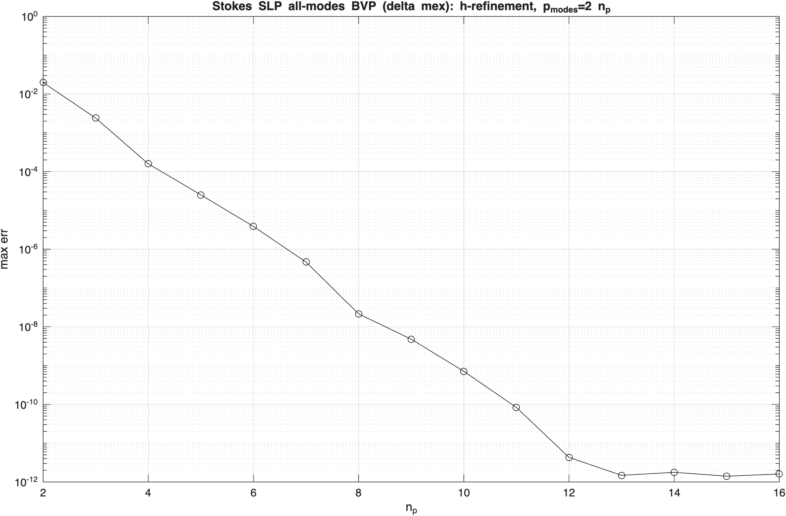 | 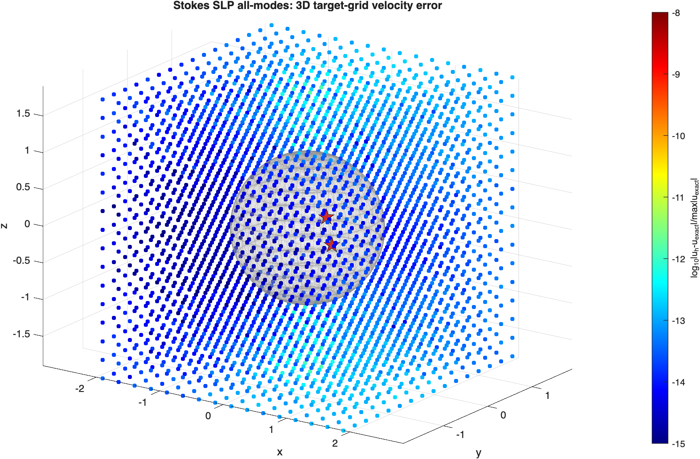 |

Combined `(D_+ + S)` exterior-Dirichlet Stokes BVP, all-modes, h-refinement
(`test_axissymsstok_stok_dlp_bvp.m`, `np=2:16`, `pmodes=2*np`): spectral convergence to the
`~1e-11` close-eval floor at `np~=11`.

| h-refinement convergence | 3D target-grid error (`np=16`) |
|---|---|
| 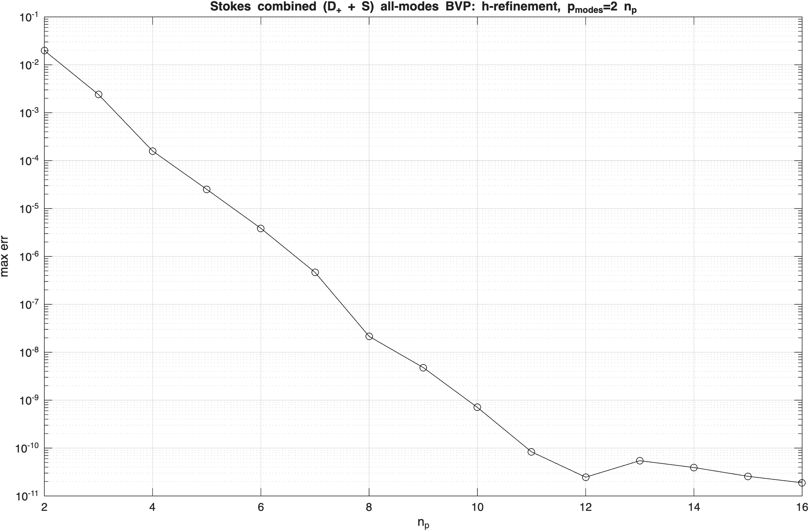 | 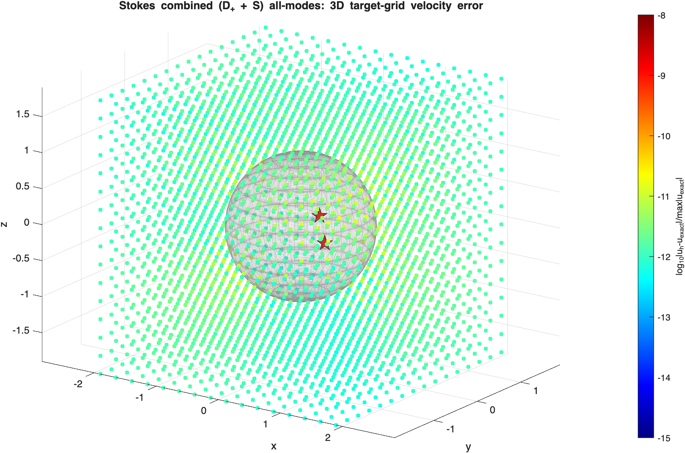 |

SLPn first-kind exterior-Neumann Stokes BVP (solve `(-1/2 I + S')mu = t`, eval velocity `S[mu]`),
all-modes, h-refinement (`test_axissymsstok_stok_slpn_bvp.m`, `np=2:16`, `pmodes=2*np`): spectral
convergence to the `~1e-11` close-eval floor at `np~=11`.

| h-refinement convergence | 3D target-grid error (`np=16`) |
|---|---|
| 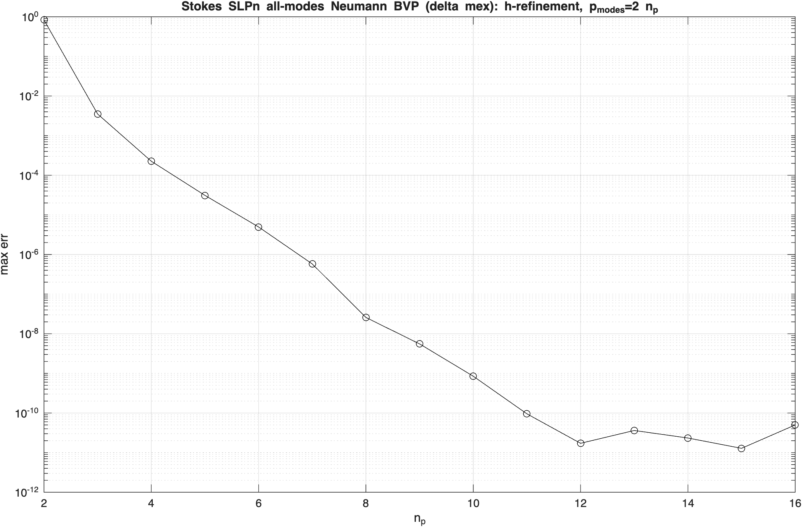 | 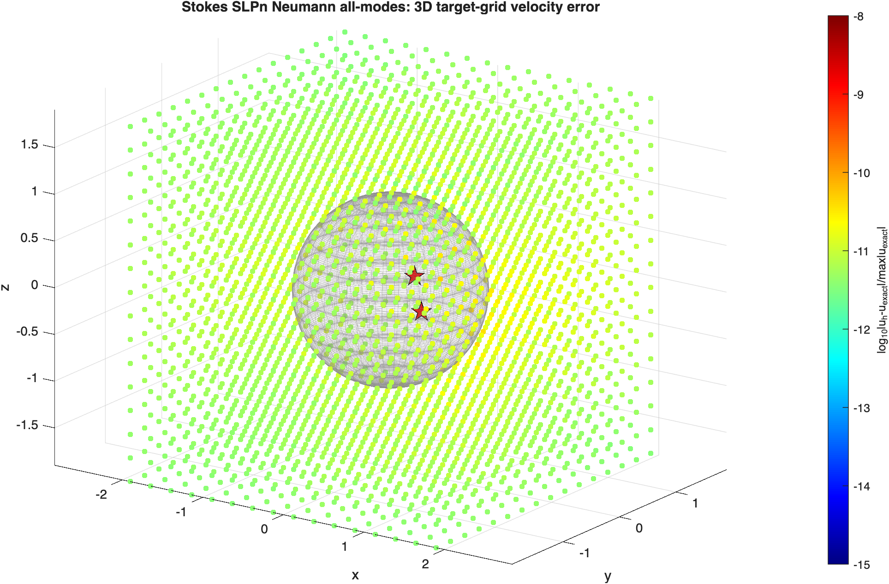 |

0th-mode-only Stokes SLP exterior-Dirichlet BVP on a c-shape (solve `S mu = u`, eval `S mu`),
exact axisymmetric-Stokeslet reference (`test_axissymsstok_stok_slp_bvp_0th.m`, `np=6:2:36`):
spectral convergence to the `~1e-13` close-eval floor.

| h-refinement convergence | meridian-grid error (`np=36`) |
|---|---|
| 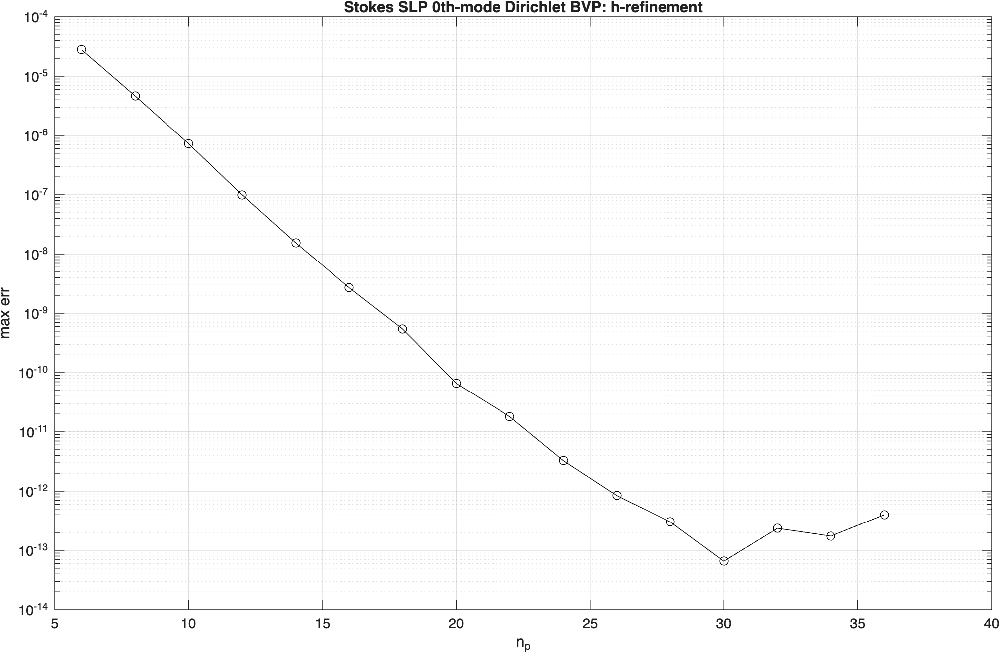 | 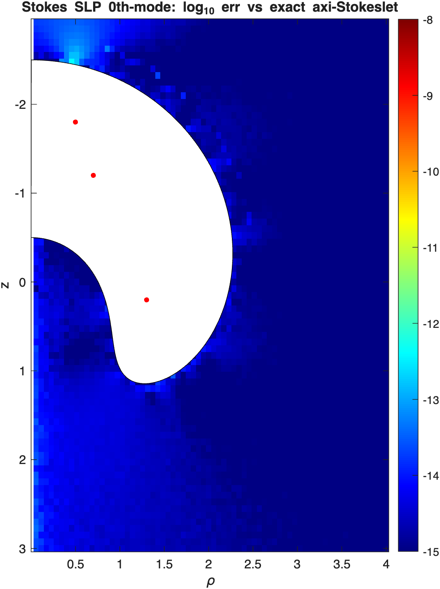 |

0th-mode-only combined `(D_+ + S)` Stokes exterior-Dirichlet BVP on a c-shape (solve `(D_+ + S)tau = u`,
eval `(D_+ + S)tau`), exact axisymmetric-Stokeslet reference (`test_axissymsstok_stok_dlp_bvp_0th.m`,
`np=6:2:36`): spectral convergence to the `~1e-11` close-eval floor.

| h-refinement convergence (something is not quite right here...) | meridian-grid error (`np=36`) |
|---|---|
| 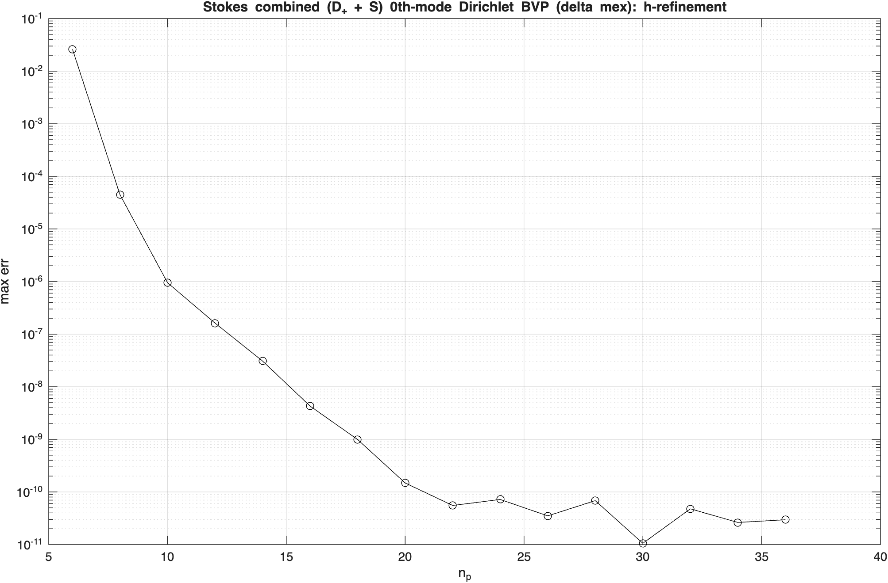 | 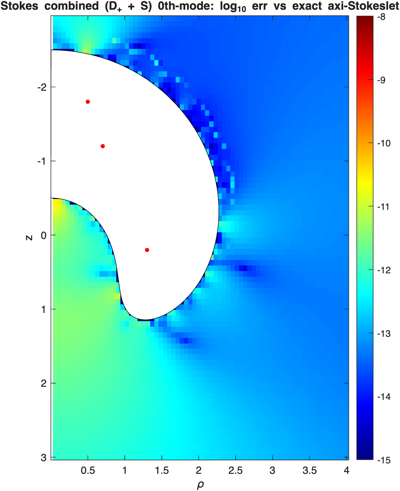 |

0th-mode-only SLPn (S') Stokes exterior-Neumann BVP on a c-shape (solve `(-1/2 I + S')mu = sigma.n`,
eval single-layer velocity `S[mu]`), exact axisymmetric-Stokeslet reference
(`test_axissymsstok_stok_slpn_bvp_0th.m`, `np=6:2:36`): spectral convergence to the `~1e-11`
close-eval floor.

| h-refinement convergence | meridian-grid error (`np=36`) |
|---|---|
| 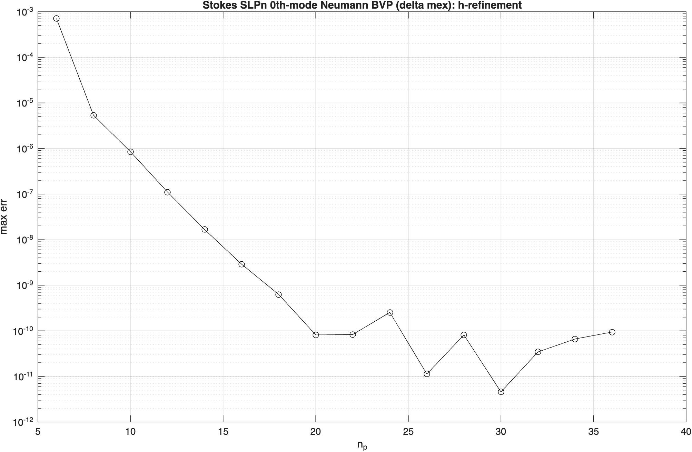 | 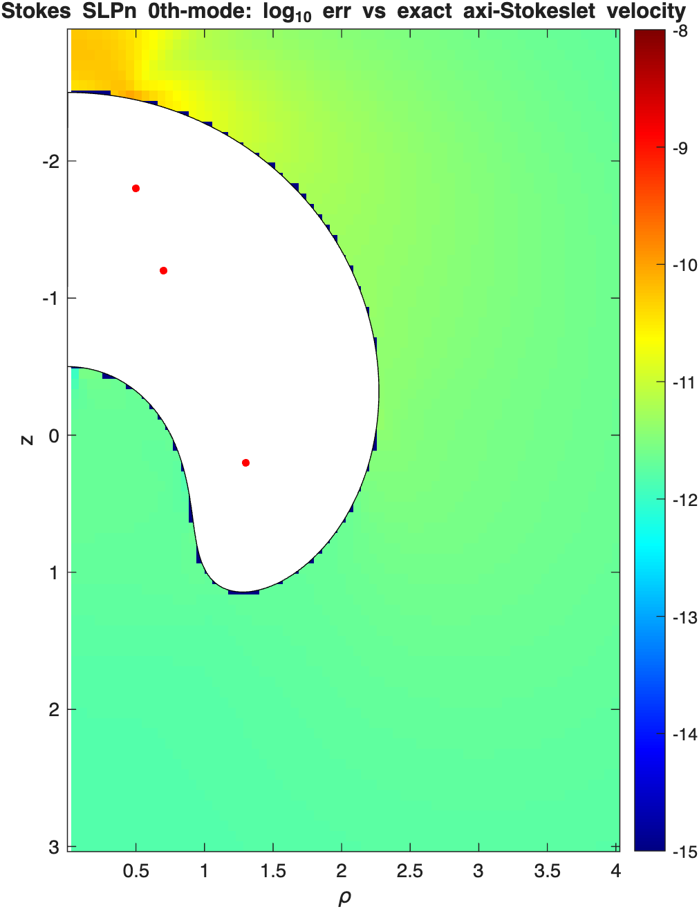 |

0th-mode-only combined-field `(D' + S')` Stokes exterior-Neumann BVP on a c-shape (solve
`(D' + S')tau = sigma.n`, eval velocity `(D + S)tau`), exact axisymmetric-Stokeslet reference
(`test_axissymsstok_stok_dlpn_bvp_0th.m`, `np=6:2:36`): spectral convergence to the `~1e-11`
close-eval floor. The combined field is well-conditioned (`cond ~1e3`, vs the `S'`-only `~1e11`).
D' is the super-singular `1/(r-r')^3` double-layer traction (five-channel split), with a `K,E`-carrier
analytic far and a graded-azimuthal close-in-far quad.

| h-refinement convergence | meridian-grid error (`np=36`) |
|---|---|
| 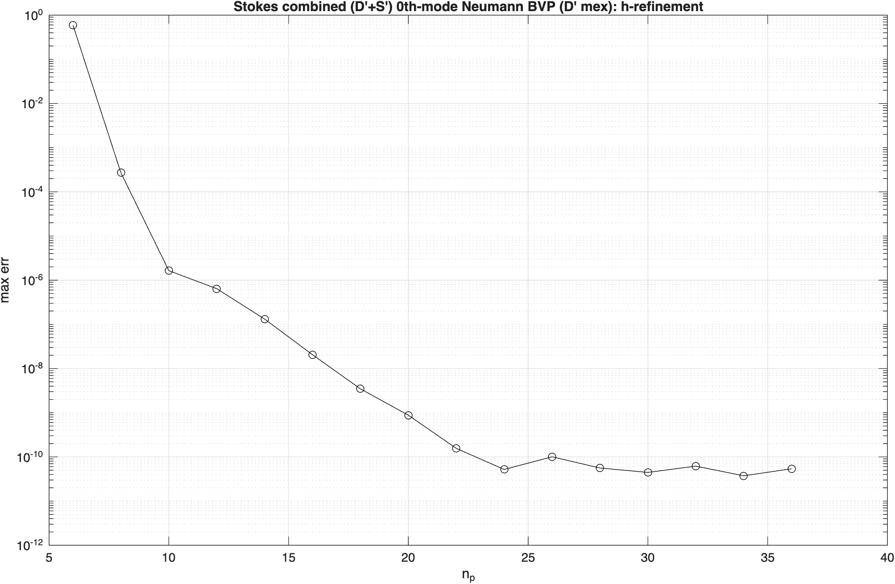 | 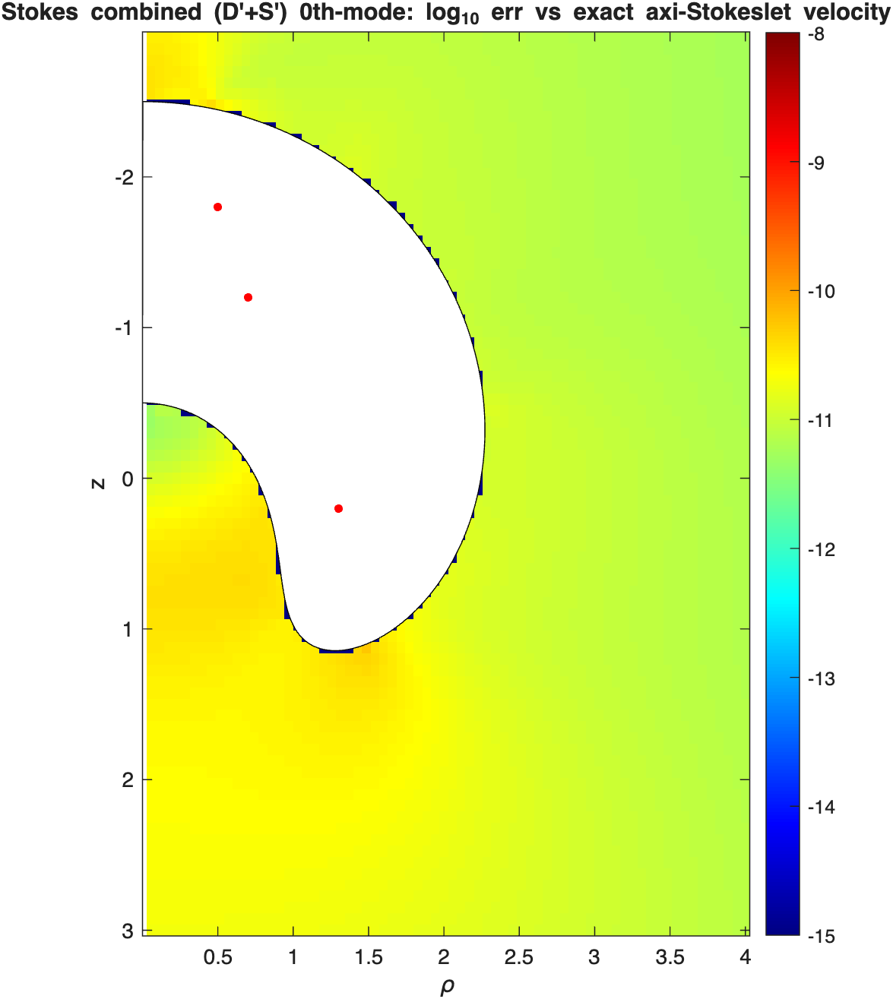 |
