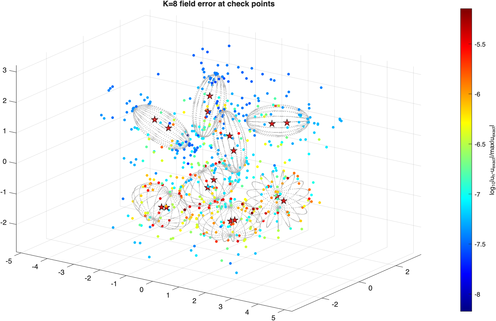
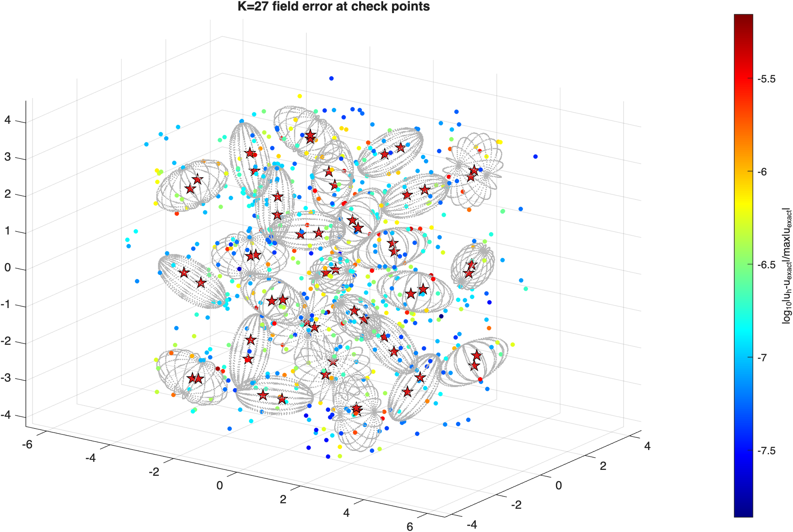
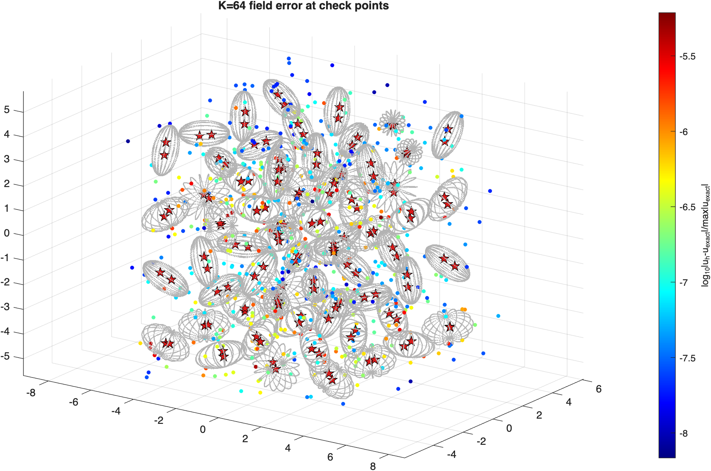

# stokes_max — measured results

## Mac M1 Max, 64 GB -- MEASURED 2026-07-03

`test_axissymsstok_stok_slpn_bvp_max_physmat.m` on a quiet machine (the earlier runs
above were CPU-contended and are superseded).  Same kernels as the per-particle
pipeline; phase-1 moved the K-loops into Fortran module state, phase-2 parallelized
them over particles.

```
>> test_axissymsstok_stok_slpn_bvp_max_physmat
p=16 np=4 nphi=17 (Nnod=1088/particle)  gate=2.0  rnear=1.71  lattice spacing 2.60  ncores=10
  err by shell:  d~0.05: 7.12e-06   d~0.3: 3.40e-06   d~1.0: 5.22e-07
K=   8  dof=   26112 :  T_setup    0.4s (T_self    0.2s 37 MB + T_cross    0.2s    8 srcs 176 MB)   [10 threads]       6917 dof/s/core
                        T_eval  0.467 s/iter (fmm eps 1e-12,   54 us/src)  iters  27 (flag=0, relres=5.5e-10)  T_solve    14s  T_eval_off   1.0s (598 tgts)  err 7.12e-06   [10 cores]      5596 dof/s/core
  err by shell:  d~0.05: 6.96e-06   d~0.3: 1.65e-06   d~1.0: 1.02e-06
K=  27  dof=   88128 :  T_setup    1.6s (T_self    0.7s 124 MB + T_cross    0.9s   27 srcs 775 MB)   [10 threads]       5603 dof/s/core
                        T_eval  2.712 s/iter (fmm eps 1e-12,   92 us/src)  iters  27 (flag=0, relres=4.8e-10)  T_solve    79s  T_eval_off   3.1s (598 tgts)  err 6.96e-06   [10 cores]      3250 dof/s/core
  err by shell:  d~0.05: 6.11e-06   d~0.3: 1.92e-06   d~1.0: 4.81e-07
K=  64  dof=  208896 :  T_setup    3.1s (T_self    1.0s 292 MB + T_cross    2.1s   64 srcs 2185 MB)   [10 threads]       6719 dof/s/core
                        T_eval  3.531 s/iter (fmm eps 1e-12,   51 us/src)  iters  27 (flag=0, relres=6.0e-10)  T_solve   103s  T_eval_off   5.3s (598 tgts)  err 6.11e-06   [10 cores]      5916 dof/s/core
```

vs the serial per-particle pipeline (section above), same machine:

| K | T_setup serial | T_setup OMP | speedup | T_eval serial | T_eval OMP | iters | err |
|---:|---:|---:|---:|---:|---:|---:|---:|
| 8  | 1.9 s  | **0.4 s** | 4.8x | 0.513 | 0.467 | 27  | 7.12e-6  |
| 27 | 7.7 s  | **1.6 s** | 4.8x | 2.746 | 2.712 | 27  | 6.96e-6  |
| 64 | 20.8 s | **3.1 s** | 6.7x | 3.869 | 3.531 | 27  | 6.11e-6  |

- Setup speedup 4.8-6.7x on 10 threads (Amdahl: crosssetup stage 1 -- canonical tree +
  ball queries -- is serial by design; its share shrinks as K grows).
- T_eval slightly better than serial (corrapply consolidation: 2K mex calls -> 1 per
  apply); errors and iteration counts identical to the serial pipeline at every K.

Particle configurations (check-point field error over the particle surfaces):

| K=8 | K=27 | K=64 |
|:---:|:---:|:---:|
|  |  |  |

K=125 and the `ultra` (K=3375, solver-module + OMP port) case: to be run by the user.
