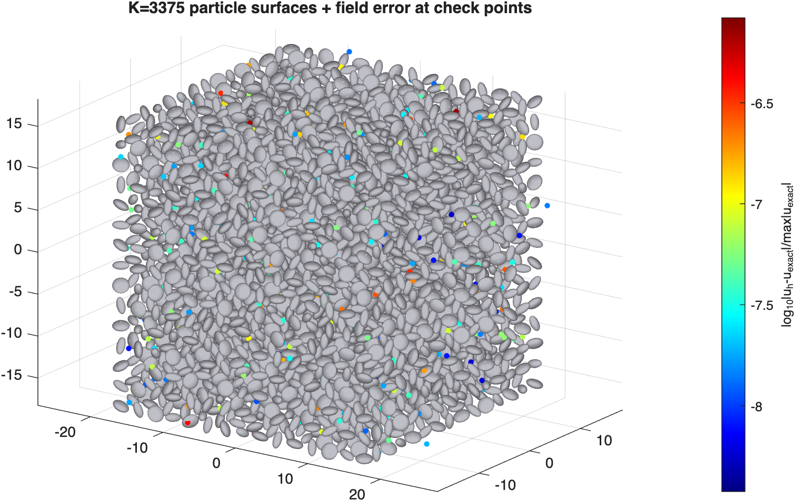

# stokes_max ULTRA — K = 15^3 = 3375 particles on a Mac Studio M3 Ultra (512 GB)

## solver module + OpenMP (`make mex OMP=ON`, 32 threads, 2026-07-03)

Same case rerun after the phase-1/phase-2 port (module-resident corrections, OpenMP
over particles, corrapply consolidated to ONE mex call per apply):

```
>> test_axissymsstok_stok_slpn_bvp_ultra_physmat
ULTRA: K=3375  p=16 np=4 nphi=17 (Nnod=1088/particle, dof=11016000)  ncores=32 predicted (measured gap-0.4 constants): corrections ~257 GB, setup ~32 min serial / ~1 min at 32 threads
  selfsetup done: 16s, 15.4 GB
  crosssetup done: 84s, 248.0 GB, 3375 src particles with near pairs
  gmres apply   1 done: 42.9s (cum 43s)
  gmres apply   2 done: 46.7s (cum 90s)
        ...
  gmres apply  28 done: 43.5s (cum 1222s)
  gmres apply  29 done: 43.7s (cum 1266s)
  err by shell:  d~0.05: 8.33e-07   d~0.3: 5.60e-07   d~1.0: 8.89e-08
K=3375  dof=11016000 :  T_setup  100.1s (T_self   16.3s 15407 MB + T_cross   83.8s 3375 srcs 248026 MB)   [32 threads]       3440 dof/s/core
                        T_eval 43.651 s/iter (fmm eps 1e-12,   12 us/src)  iters  27 (flag=0, relres=6.5e-10)  T_solve  1269s  T_eval_off  48.6s (591 tgts)  err 8.33e-07   [32 cores]      7886 dof/s/core
```

vs the serial per-particle run (section 1):

| quantity | serial (sec. 1) | solver module + OMP | factor |
|---|---:|---:|---:|
| T_self | 370.6 s | **16.3 s** | 22.7x |
| T_cross | 1576.5 s | **83.8 s** | 18.8x (includes the SERIAL canonical-tree stage over 3.7 M pts) |
| T_setup total | 32.5 min | **100 s** | 19.4x |
| T_eval | 81.5 s/iter | **43.7 s/iter** | 1.9x (corrapply: 6750 mex calls -> 1 per apply; FMM 22 -> 12 us/src) |
| T_solve | 39.4 min | **21.2 min** | 1.9x |
| gmres iters / relres | 27 / 6.5e-10 | 27 / 6.5e-10 | identical |
| field err (near/mid/far) | 8.33e-07 | 8.33e-07 / 5.60e-07 / 8.89e-08 | identical (shell breakdown now printed) |
| corrections memory | 263 GB | 263 GB (248 cross + 15.4 self) | identical |

End-to-end wall clock for the full K=3375 solve: setup + solve + off-surface eval
~ **24 minutes** (was ~72).  The apply is now cleanly FMM-dominated; the next eval
lever is phase 3 (PVFMM tree reuse across the 28 applies).

