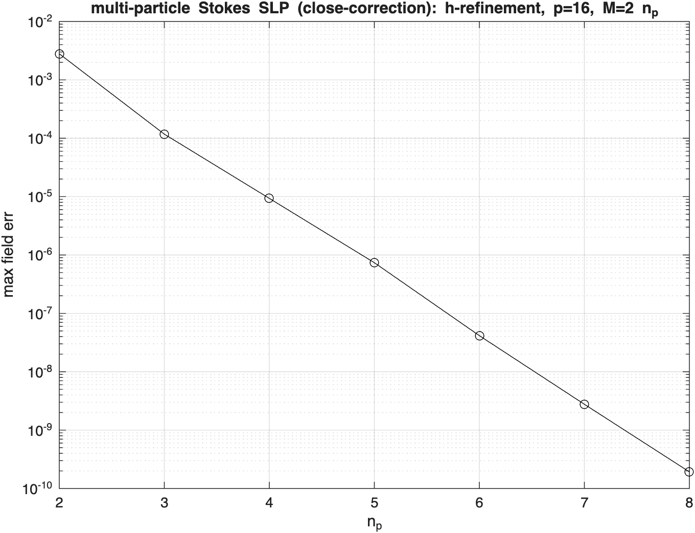
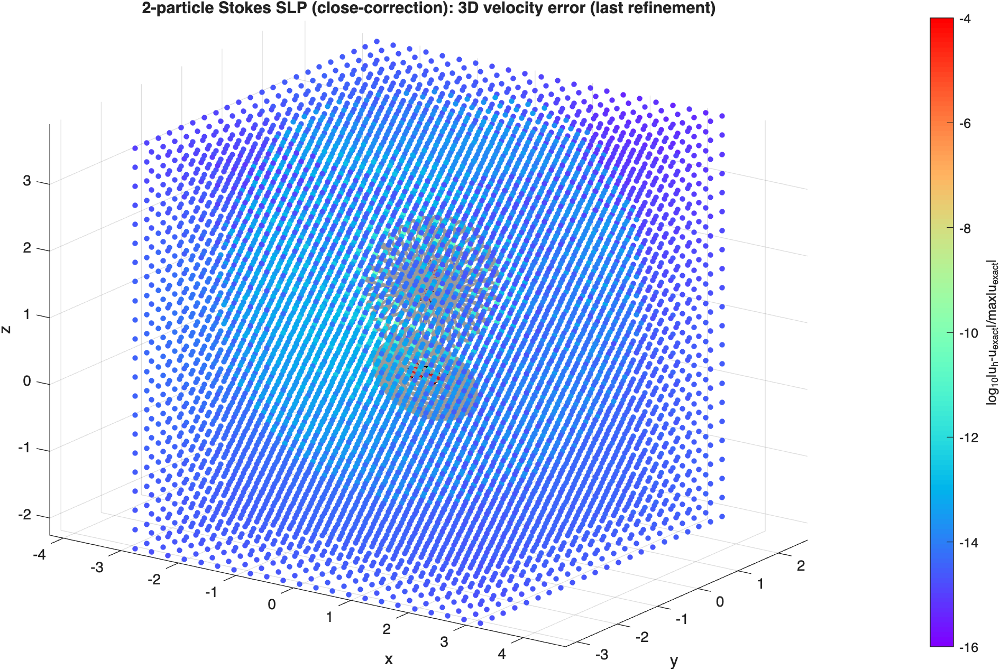
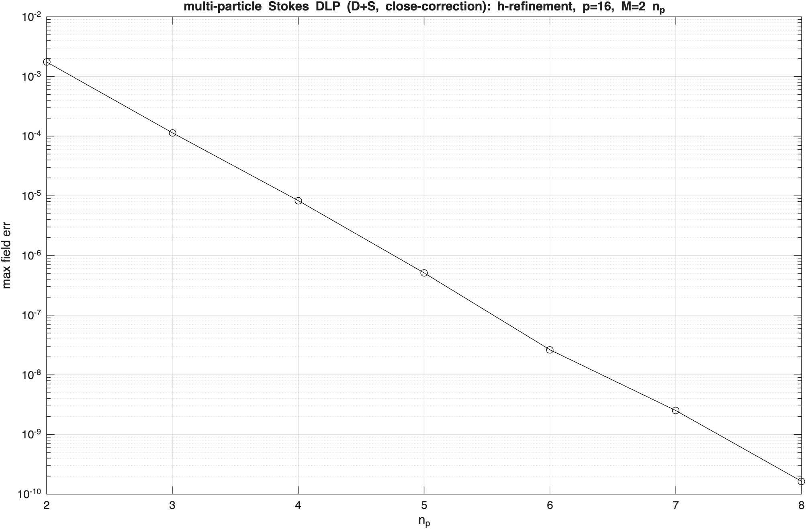
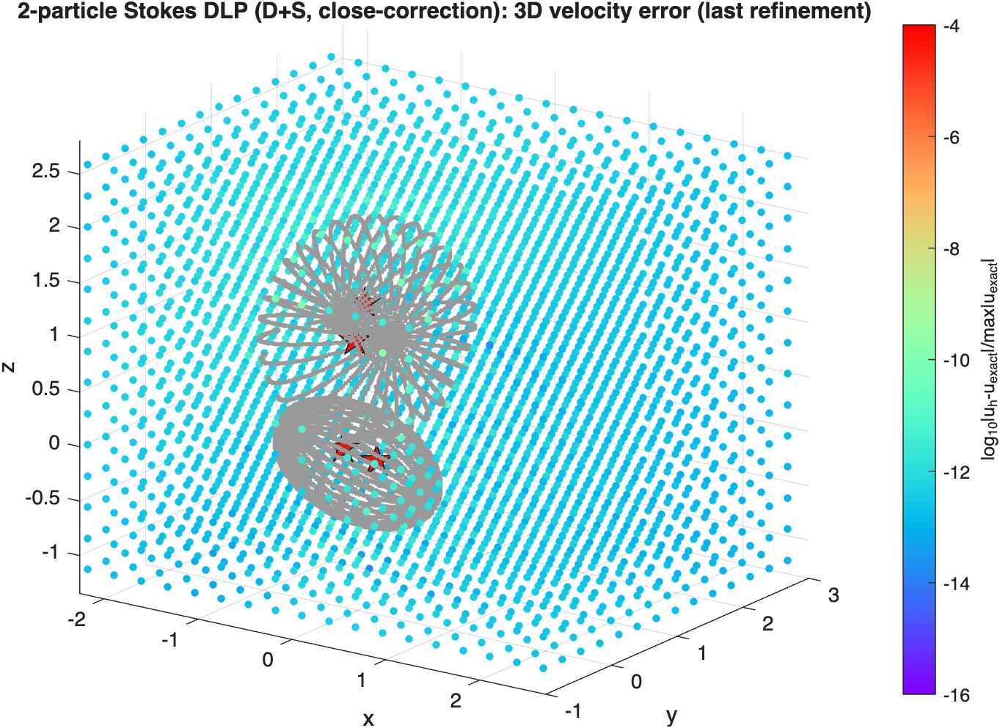
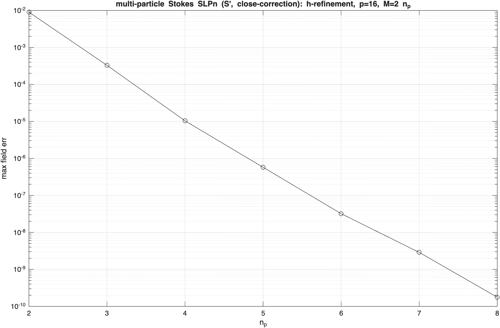
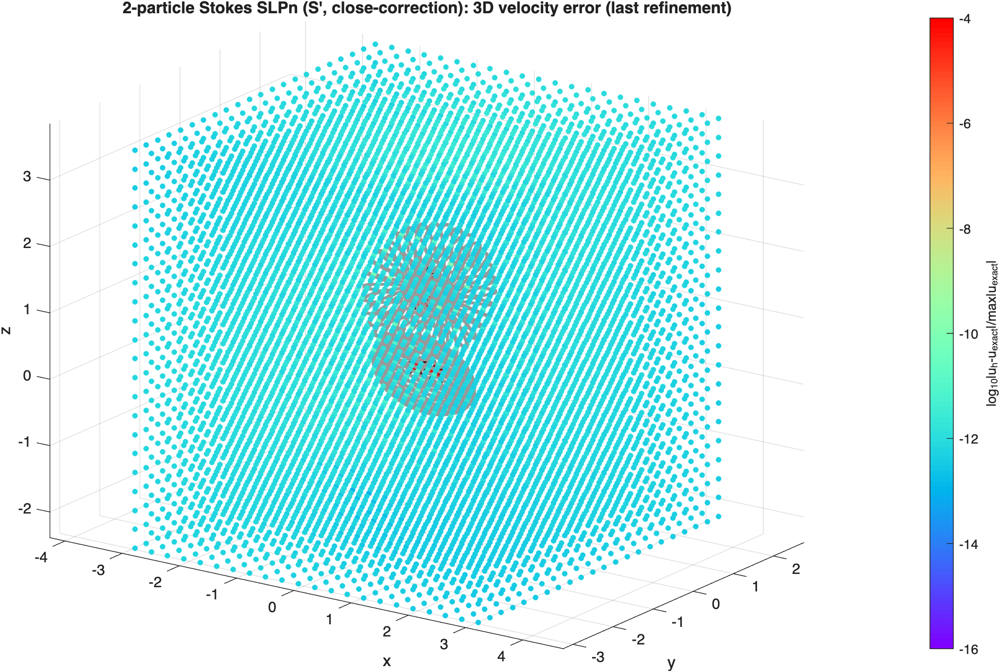
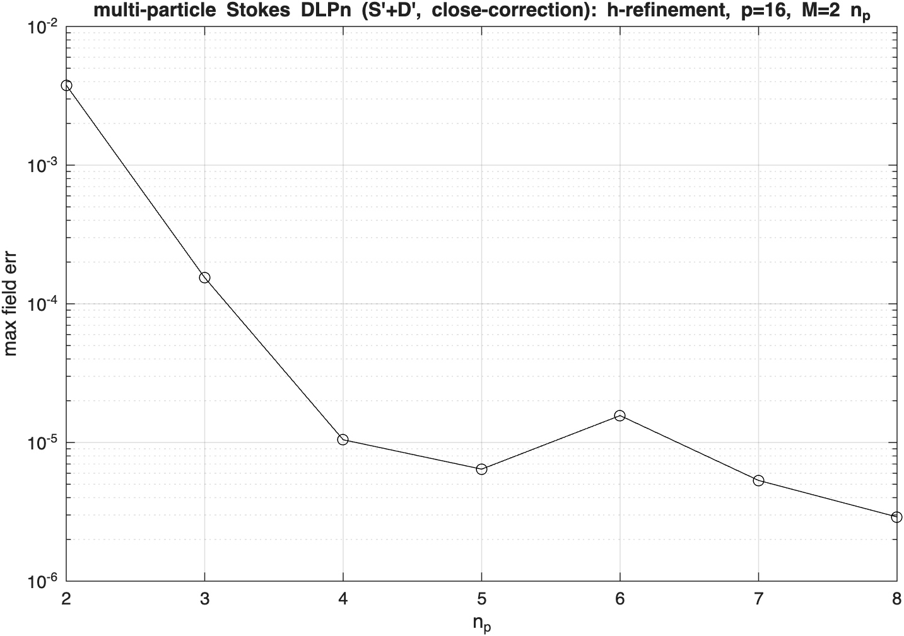
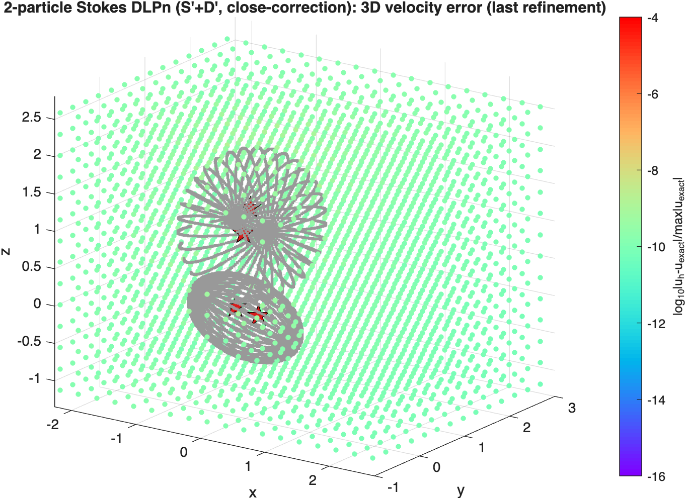

# axp — multi-particle Stokes physical-space operators (close correction)

## Results

Two prolate/oblate spheroids in random pose, assembled in the lab node-interleaved frame
`[v1x v1y v1z v2x ...]`; interior Stokeslets inside each body give the exact exterior velocity. Every
layer uses the same close-correction architecture — a naive full operator `S` (FMM-replaceable) plus a
sparse `Scorr` (per-particle self diffs + kdtree near off-diagonal diffs), solved as `(S+Scorr) sigma`,
then evaluated as naive-full + per-source near close-correction. h-refinement of the panel count
(`np=2:8`, `M=2*np`, `p=16`). The near band reaches the close-eval floor (not the naive `~1e-3`)
because near targets go through the off-diagonal close-eval rather than the naive kernel.

### SLP — single-layer exterior Dirichlet

`test_axissymsstok_stok_slp_bvp_multi.m`. Solve `(S+Scorr)[sigma] = u_ex`, eval the SLP velocity. The
single-layer operator is rank-deficient (Stokes SLP pressure null space), so the density is the
minimum-norm solution (`lsqminnorm`). Spectral convergence `~3e-3` (`np=2`) → `~2e-10` (`np=8`).

| h-refinement convergence | 3D target-grid velocity error (last refinement) |
|---|---|
|  |  |

### DLP — combined-field (D+S) exterior Dirichlet

`test_axissymsstok_stok_dlp_bvp_multi.m`. Combined-field representation `(D+S)[sigma]` (mirror omega3
`test_StoDLPAxiPhysMat0`): the `+1/2 I` exterior jump rides in the DLP self block and the SLP regularizes
the DLP rigid-body null space, so the operator is full-rank and solved by backslash. Both `D` and `S`
contribute to the self operator, the naive full (`Sto3dDLPmat+Sto3dSLPmat`), and the off-diagonal close
correction. Spectral convergence `~1.8e-3` (`np=2`) → `~1.5e-10` (`np=8`).

| h-refinement convergence | 3D target-grid velocity error (last refinement) |
|---|---|
|  |  |

The naive full operator is FMM-replaceable (`Sto3dSLPfmm` / `Sto3dDLPfmm`, component-major, same
`1/(8π)` Stokeslet / stresslet) — see `test_axissymsstok_stok_dlp_bvp_multi2.m` for the 5-particle,
matrix-free FMM-coupled (D+S) variant solved with GMRES.

### SLPn — single-layer traction (S') exterior Neumann

`test_axissymsstok_stok_slpn_bvp_multi.m` (mirror omega3 `test_StoSLPnAxiPhysMat0`). Pure single-layer
representation `u = S[sigma]`; match the surface traction `S'[sigma] = t_ex` (the `-1/2 I` exterior jump
rides in the SLPn self block). `S'` carries the target normals — self `S'_kk = T*(Finv*Ab*F)*T'`, near
off-diag `Pi_n*(B*Fs)*T_src'` — and is rank-deficient, so the density is min-norm (`lsqminnorm`). The
system is assembled on the traction; the field is then evaluated as the SLP velocity (same close-eval as
the SLP test). Spectral convergence `~9e-3` (`np=2`) → `~1.7e-10` (`np=8`).

| h-refinement convergence | 3D target-grid velocity error (last refinement) |
|---|---|
|  |  |

### DLPn — combined-field traction (S'+D') exterior Neumann

`test_axissymsstok_stok_dlpn_bvp_multi.m` (mirror omega3 `test_StoDLPnAxiPhysMat0`). Combined-field
representation `u = (S+D)[sigma]`; match the surface traction `(S'+D')[sigma] = t_ex` (the `-1/2 I` jump
rides in the SLPn self block, the `S'` regularizes the hypersingular `D'` → full-rank, backslash). Same
close-correction assembly as SLPn with traction data and target normals, plus the `D'` block and its
source normals; the field is evaluated as the `(S+D)` velocity.

| h-refinement convergence | 3D target-grid velocity error (last refinement) |
|---|---|
|  |  |

~~This DLPn test uses particle separation **1.8** (the other Stokes/Laplace layers use 1.6). At 1.8 it
**converges to the close-eval floor**: `~6e-3` (`np=2`) → `~3–5e-9` (`np=7,8`), like the other layers
(corroborated by the fully-mex `multi0` solve at 1.8, rel `7.67e-9`). The hypersingular `D'` is the only
gap-sensitive layer: at the **1.6** separation (gap `~0.05`) the `D'` close-eval under-resolves and the
field stalls at `~1e-5`, whereas DLP/SLPn converge fine at 1.6.~~

~~**Open (figure out later):** *why* 1.6 fails for `D'` specifically is not yet confirmed — most likely
azimuthal/meridian resolution at the `~0.05` tight gap (the same stall appears for both the mex and the
MATLAB blocks), but this still needs to be pinned down.~~

**Fixed in d74e81b (DLP pres) 5335760 (SLP pres):** related to both SLPn and DLPn, then turns out to be 
related to SLP pres and DLP pres SLP pres kernel split formula was wrong, DLP pres was mostly parameter 
tweak...

This DLPn test uses particle separation **1.6** (the same as other Stokes/Laplace layers use 1.6). 
velocity field converges to `~1e-9`.